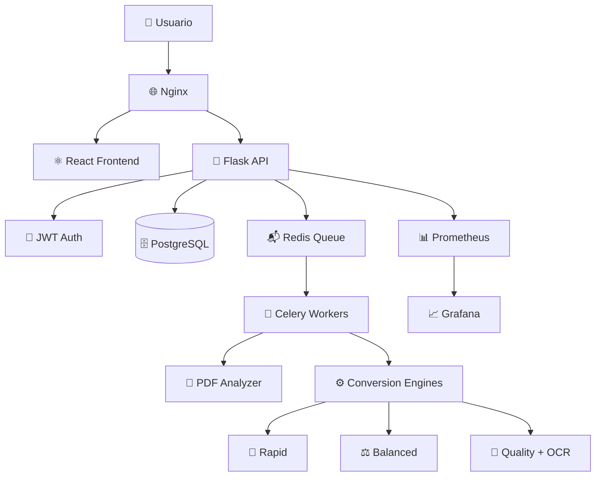

# 📚 Anclora PDF2EPUB

> **Sistema de conversión inteligente de documentos PDF a formato EPUB3 con IA integrada**

[](https://opensource.org/licenses/MIT)
[](https://www.docker.com/)
[](https://www.python.org/)
[](https://reactjs.org/)
[](https://www.typescriptlang.org/)

Anclora PDF2EPUB es una aplicación web empresarial que revoluciona la conversión de documentos PDF a EPUB3 mediante análisis inteligente con IA y motores de conversión especializados. Diseñada para editores digitales, instituciones educativas y desarrolladores que requieren conversiones de alta calidad y escalabilidad.

## ✨ Características Principales

### 🧠 **Análisis Inteligente con IA**
- Detección automática de 6 tipos de contenido diferentes
- Análisis de complejidad con score 1-5
- Recomendación automática del motor óptimo
- Detección de idioma y elementos especiales

### 🚀 **Motores de Conversión Especializados**
- **Rapid Engine**: Documentos simples (2-5 segundos)
- **Balanced Engine**: Documentos mixtos (10-30 segundos)
- **Quality Engine**: Documentos complejos con OCR (30-120 segundos)

### 📊 **Transparencia Total**
- Métricas detalladas de calidad en tiempo real
- Logs estructurados para auditoría
- Dashboard de monitoreo con Prometheus + Grafana
- Historial completo de conversiones

### ⚡ **Arquitectura Cloud-Ready**
- Microservicios escalables con Docker
- Procesamiento asíncrono con Celery
- Base de datos PostgreSQL para alta concurrencia
- API REST completa con autenticación JWT

### 🎨 **Experiencia de Usuario Moderna**
- Interfaz React + TypeScript responsive
- Tema claro/oscuro con persistencia
- Drag & drop con validación en tiempo real
- Descarga automática de resultados

## 🏗️ Arquitectura del Sistema


## 🚀 Inicio Rápido

### Requisitos Previos

- **Docker** y **Docker Compose** (requerido)
- **Git** para clonar el repositorio
- **Node.js 18+** (solo para desarrollo local)
- **Python 3.11+** (solo para desarrollo local)

### Instalación con Docker (Recomendado)

1. **Clonar el repositorio:**
```bash
git clone https://github.com/ToniIAPro73/Anclora-PDF2EPUB-Claude.git
cd Anclora-PDF2EPUB-Claude
```

2. **Configurar variables de entorno:**
```bash
# Crear archivo .env en la raíz del proyecto
cp .env.example .env
```

Contenido del archivo `.env`:
```env
# Configuración de puertos
FRONTEND_PORT=3003
BACKEND_PORT=5175
NGINX_PORT=80
WORKER_METRICS_PORT=8001

# Configuración de Redis
REDIS_PORT=6379
REDIS_PASSWORD=anclora_redis_password

# Configuración de PostgreSQL
POSTGRES_DB=anclora_pdf2epub
POSTGRES_USER=anclora_user
POSTGRES_PASSWORD=anclora_password
POSTGRES_PORT=5432

# Configuración de la aplicación
FLASK_ENV=development
FLASK_APP=app
SECRET_KEY=your_super_secret_key_here
JWT_SECRET=your_jwt_secret_here
JWT_EXPIRATION=3600

# Configuración de almacenamiento
UPLOAD_FOLDER=uploads
RESULTS_FOLDER=results

# Configuración de recursos
MAX_WORKERS=4
CONVERSION_TIMEOUT=300
```

3. **Iniciar todos los servicios:**
```bash
docker-compose up -d
```

4. **Verificar que todos los servicios estén ejecutándose:**
```bash
docker-compose ps
```

5. **Acceder a la aplicación:**
- **Aplicación principal**: http://localhost
- **Frontend directo**: http://localhost:3003
- **API Backend**: http://localhost:5175/api
- **Grafana Dashboard**: http://localhost:3004 (admin/admin)
- **Prometheus Metrics**: http://localhost:9090

### Primer Uso

1. **Registrar un usuario:**
```bash
curl -X POST http://localhost/api/auth/register \
  -H 'Content-Type: application/json' \
  -d '{"username":"admin","password":"admin123"}'
```

2. **Iniciar sesión:**
```bash
curl -X POST http://localhost/api/auth/login \
  -H 'Content-Type: application/json' \
  -d '{"username":"admin","password":"admin123"}'
```

3. **Usar la interfaz web:**
   - Navegar a http://localhost
   - Iniciar sesión con las credenciales creadas
   - Subir un archivo PDF y comenzar la conversión
## 🛠️ Desarrollo Local

### Frontend (React + TypeScript)

```bash
cd frontend
npm install
npm run dev
```
El servidor de desarrollo iniciará en http://localhost:3003

### Backend (Flask + Celery)

```bash
cd backend
python -m venv venv
source venv/bin/activate  # En Windows: venv\Scripts\activate
pip install -r requirements.txt
flask run --port=5175
```

### Worker de Celery

```bash
cd backend
celery -A app.celery worker --loglevel=info
```

### Servicios Auxiliares

```bash
# Redis (requerido para Celery)
docker run -d -p 6379:6379 redis:7-alpine

# PostgreSQL (requerido para persistencia)
docker run -d -p 5432:5432 -e POSTGRES_DB=anclora_pdf2epub -e POSTGRES_USER=anclora_user -e POSTGRES_PASSWORD=anclora_password postgres:15
```

## 🧪 Testing

### Tests Backend
```bash
cd backend
pytest tests/ -v
```

### Tests Frontend
```bash
cd frontend
npm test
```

### Tests de Integración
```bash
# Con Docker Compose ejecutándose
cd backend
pytest tests/integration/ -v
```

## 📡 API Reference

### Autenticación

| Endpoint | Método | Descripción |
|----------|--------|-------------|
| `/api/auth/register` | POST | Registrar nuevo usuario |
| `/api/auth/login` | POST | Iniciar sesión y obtener JWT |

### Conversión

| Endpoint | Método | Descripción | Auth |
|----------|--------|-------------|------|
| `/api/analyze` | POST | Analizar PDF y obtener recomendaciones | ✅ |
| `/api/convert` | POST | Iniciar conversión PDF→EPUB | ✅ |
| `/api/status/<task_id>` | GET | Obtener estado de conversión | ✅ |
| `/api/history` | GET | Historial de conversiones | ✅ |

### Monitoreo

| Endpoint | Método | Descripción |
|----------|--------|-------------|
| `/metrics` | GET | Métricas Prometheus |
| `/health` | GET | Health check |

### Ejemplo de Uso de API

```bash
# 1. Registrar usuario
curl -X POST http://localhost/api/auth/register \
  -H 'Content-Type: application/json' \
  -d '{"username":"testuser","password":"testpass123"}'

# 2. Obtener token
TOKEN=$(curl -X POST http://localhost/api/auth/login \
  -H 'Content-Type: application/json' \
  -d '{"username":"testuser","password":"testpass123"}' | jq -r '.token')

# 3. Analizar PDF
curl -X POST http://localhost/api/analyze \
  -H "Authorization: Bearer $TOKEN" \
  -F "file=@document.pdf"

# 4. Convertir PDF
curl -X POST http://localhost/api/convert \
  -H "Authorization: Bearer $TOKEN" \
  -F "file=@document.pdf" \
  -F "pipeline_id=balanced"
```

## 📁 Estructura del Proyecto

```
anclora-pdf2epub/
├── 📁 frontend/                    # Aplicación React + TypeScript
│   ├── 📁 public/                  # Archivos estáticos
│   ├── 📁 src/
│   │   ├── 📁 components/          # Componentes React
│   │   │   ├── ConversionPanel.tsx # Panel de conversión
│   │   │   ├── FileUploader.tsx    # Subida de archivos
│   │   │   ├── ConversionHistory.tsx # Historial
│   │   │   └── MetricsDisplay.tsx  # Métricas
│   │   ├── App.tsx                 # Componente principal
│   │   ├── AuthContext.tsx         # Context de autenticación
│   │   └── index.tsx               # Punto de entrada
│   ├── package.json                # Dependencias npm
│   ├── tsconfig.json               # Configuración TypeScript
│   └── vite.config.js              # Configuración Vite
│
├── 📁 backend/                     # API Flask + Celery
│   ├── 📁 app/
│   │   ├── __init__.py             # Factory Flask
│   │   ├── routes.py               # Endpoints API REST
│   │   ├── tasks.py                # Tareas Celery asíncronas
│   │   ├── converter.py            # Motores de conversión
│   │   ├── pipeline.py             # Pipeline de procesamiento
│   │   ├── auth.py                 # Autenticación JWT
│   │   └── models.py               # Modelos SQLAlchemy
│   ├── 📁 tests/                   # Tests unitarios/integración
│   └── requirements.txt            # Dependencias Python
│
├── 📁 docker/                      # Configuración Docker
│   ├── 📁 nginx/
│   │   └── nginx.conf              # Proxy reverso
│   ├── Dockerfile.frontend         # Imagen Docker frontend
│   └── Dockerfile.backend          # Imagen Docker backend
│
├── 📁 docs/                        # Documentación
│   └── ANALISIS_TECNICO_COMPLETO_ANCLORA.md
│
├── .env                            # Variables de entorno
├── docker-compose.yml              # Orquestación 7 servicios
├── README.md                       # Esta documentación
└── .gitignore                      # Archivos ignorados por Git
```
## 📖 Guía de Uso

### 1. 📤 Subir un PDF

1. **Acceder a la aplicación** en http://localhost
2. **Iniciar sesión** con tus credenciales
3. **Arrastrar y soltar** un archivo PDF o hacer clic para seleccionarlo
4. **Validación automática**: El sistema verifica formato y tamaño (máx. 50MB)

### 2. 🔍 Análisis Automático

El sistema analiza automáticamente el documento y detecta:
- **Tipo de contenido**: Texto, imágenes, escaneado, técnico, académico
- **Complejidad**: Score de 1-5 basado en múltiples factores
- **Idioma**: Detección automática
- **Elementos especiales**: Tablas, fórmulas, gráficos

### 3. ⚙️ Selección de Motor

Basado en el análisis, se recomienda automáticamente el motor óptimo:
- **🚀 Rapid**: Para documentos simples
- **⚖️ Balanced**: Para documentos mixtos
- **💎 Quality**: Para documentos complejos

### 4. 🔄 Conversión en Tiempo Real

- **Progreso visual**: Barra de progreso con etapas detalladas
- **Logs en vivo**: Información detallada del procesamiento
- **Métricas**: Tiempo estimado y calidad esperada

### 5. 📥 Descarga y Resultados

- **Métricas de calidad**: Porcentaje de texto/imágenes preservadas
- **Descarga automática**: El EPUB se descarga al completarse
- **Historial**: Todas las conversiones quedan registradas

## 🎯 Motores de Conversión Especializados

### 🚀 **Rapid Engine**
```yaml
Propósito: Documentos simples de solo texto
Tecnologías: PyMuPDF + EbookLib
Tiempo típico: 2-5 segundos
Calidad: 95% texto, 0% imágenes
Casos de uso:
  - Artículos académicos
  - Documentos oficiales
  - Libros de texto simple
```

### ⚖️ **Balanced Engine**
```yaml
Propósito: Documentos con texto e imágenes
Tecnologías: PyMuPDF + EbookLib + Image Processing
Tiempo típico: 10-30 segundos
Calidad: 100% texto, 90% imágenes
Casos de uso:
  - Informes empresariales
  - Presentaciones
  - Manuales ilustrados
  - Revistas digitales
```

### 💎 **Quality Engine**
```yaml
Propósito: Documentos complejos y escaneados
Tecnologías: Tesseract OCR + Advanced Processing
Tiempo típico: 30-120 segundos
Calidad: 100% texto (con OCR), 100% imágenes
Casos de uso:
  - Documentos escaneados
  - PDFs con fórmulas matemáticas
  - Libros técnicos complejos
  - Documentos históricos
```


## ⚙️ Configuración Avanzada

### 🔧 Personalización de Puertos

Modifica los valores en el archivo `.env`:

```env
FRONTEND_PORT=3003        # Puerto para el frontend React
BACKEND_PORT=5175         # Puerto para la API Flask
NGINX_PORT=80             # Puerto para Nginx
WORKER_METRICS_PORT=8001  # Puerto métricas del worker
POSTGRES_PORT=5432        # Puerto PostgreSQL
REDIS_PORT=6379           # Puerto Redis
```

### 📈 Escalado de Workers

Para mejorar el rendimiento en conversiones paralelas, ajusta el número de workers:

```yaml
# En docker-compose.yml
worker:
  deploy:
    replicas: 4  # Ajusta según CPU disponible
  environment:
    - CELERY_CONCURRENCY=2  # Procesos por worker
```

### 🔍 Monitoreo y Observabilidad

#### Prometheus Metrics
- **URL**: http://localhost:9090
- **Métricas disponibles**:
  - `conversion_requests_total`
  - `conversion_duration_seconds`
  - `conversion_errors_total`
  - `active_workers`

#### Grafana Dashboard
- **URL**: http://localhost:3004
- **Credenciales**: admin/admin
- **Dashboards preconfigurados**:
  - Conversions Overview
  - System Performance
  - Error Tracking

### 🔒 Configuración de Seguridad

```env
# JWT Configuration
JWT_SECRET=your_super_secure_jwt_secret_here
JWT_EXPIRATION=3600  # 1 hora

# Rate Limiting
RATE_LIMIT_PER_MINUTE=60
RATE_LIMIT_PER_HOUR=1000

# File Upload Limits
MAX_FILE_SIZE=52428800  # 50MB
ALLOWED_EXTENSIONS=pdf
```

## 🚨 Solución de Problemas

### Problemas Comunes

#### ❌ Los contenedores no inician correctamente

```bash
# Verificar logs detallados
docker-compose logs -f

# Verificar estado de servicios
docker-compose ps

# Reiniciar servicios específicos
docker-compose restart backend worker

# Reconstruir imágenes
docker-compose build --no-cache
```

#### ❌ Error en conversión de PDFs escaneados

```bash
# Verificar que Tesseract esté instalado
docker-compose exec worker tesseract --version

# Verificar logs del worker
docker-compose logs worker

# Probar con motor Quality específicamente
curl -X POST http://localhost/api/convert \
  -H "Authorization: Bearer $TOKEN" \
  -F "file=@document.pdf" \
  -F "pipeline_id=quality"
```

#### ❌ Problemas de permisos en volúmenes

```bash
# Corregir permisos de directorios
sudo chown -R 1000:1000 ./uploads ./results

# Verificar permisos
ls -la uploads/ results/

# Recrear volúmenes si es necesario
docker-compose down -v
docker-compose up -d
```

#### ❌ Base de datos no conecta

```bash
# Verificar PostgreSQL
docker-compose logs postgres

# Conectar manualmente para debug
docker-compose exec postgres psql -U anclora_user -d anclora_pdf2epub

# Reinicializar base de datos
docker-compose down
docker volume rm anclora-pdf2epub-claude_postgres_data
docker-compose up -d
```
## 🗺️ Roadmap

### ✅ **Completado (v1.0)**
- ✅ Sistema de conversión PDF→EPUB con 3 motores especializados
- ✅ Análisis automático con IA (6 tipos de contenido)
- ✅ Interfaz React moderna con autenticación JWT
- ✅ Arquitectura de microservicios con Docker
- ✅ OCR integrado para documentos escaneados
- ✅ Monitoreo con Prometheus + Grafana
- ✅ API REST completa con documentación
- ✅ Tests unitarios e integración

### 🔄 **En Desarrollo (v1.1)**
- ⏳ Vista previa EPUB integrada en el navegador
- ⏳ Cache de resultados con Redis
- ⏳ Batch processing para múltiples archivos
- ⏳ Editor post-conversión básico

### 🔜 **Próximas Versiones**
- 🔜 API pública con rate limiting por API key
- 🔜 Webhooks para notificaciones externas
- 🔜 Multi-tenancy para organizaciones
- 🔜 Integración SSO (LDAP, SAML, OAuth)
- 🔜 Internacionalización (ES, EN, FR)
- 🔜 Mobile app (React Native)

## 🤝 Contribuir

¡Las contribuciones son bienvenidas! Por favor sigue estos pasos:

### 1. **Fork y Clone**
```bash
git clone https://github.com/tu-usuario/Anclora-PDF2EPUB-Claude.git
cd Anclora-PDF2EPUB-Claude
```

### 2. **Crear Rama de Feature**
```bash
git checkout -b feature/amazing-feature
```

### 3. **Desarrollo**
```bash
# Instalar dependencias
docker-compose up -d

# Hacer cambios y probar
npm test  # Frontend
pytest    # Backend
```

### 4. **Commit y Push**
```bash
git add .
git commit -m "feat: add amazing feature"
git push origin feature/amazing-feature
```

### 5. **Pull Request**
- Abrir PR con descripción detallada
- Asegurar que todos los tests pasen
- Solicitar review del equipo

### 📋 **Guidelines de Contribución**
- Seguir convenciones de código existentes
- Añadir tests para nuevas funcionalidades
- Actualizar documentación cuando sea necesario
- Usar commits semánticos (feat, fix, docs, etc.)

## 📊 Stack Tecnológico

### **Frontend**
- **React 18.2** + **TypeScript 5.2**
- **Vite** (build tool)
- **Tailwind CSS** (styling)
- **React Router** (routing)
- **React Dropzone** (file upload)

### **Backend**
- **Flask 3.0** (web framework)
- **Celery 5.3** (async processing)
- **SQLAlchemy 3.1** (ORM)
- **PostgreSQL 15** (database)
- **Redis 7** (message broker)
- **PyJWT** (authentication)

### **Infraestructura**
- **Docker** + **Docker Compose**
- **Nginx** (reverse proxy)
- **Prometheus** (metrics)
- **Grafana** (monitoring)

### **Herramientas de Conversión**
- **PyMuPDF** (PDF processing)
- **EbookLib** (EPUB generation)
- **Tesseract OCR** (text recognition)
- **Pandoc** (document conversion)
- **pdf2htmlEX** (PDF to HTML)

## 📄 Licencia

Este proyecto está licenciado bajo la **Licencia MIT** - ver el archivo [LICENSE](LICENSE) para más detalles.

```
MIT License

Copyright (c) 2024 Anclora Team

Permission is hereby granted, free of charge, to any person obtaining a copy
of this software and associated documentation files (the "Software"), to deal
in the Software without restriction, including without limitation the rights
to use, copy, modify, merge, publish, distribute, sublicense, and/or sell
copies of the Software, and to permit persons to whom the Software is
furnished to do so, subject to the following conditions:

The above copyright notice and this permission notice shall be included in all
copies or substantial portions of the Software.
```

## 👥 Equipo y Contacto

### **Desarrollado por**
- **Equipo Anclora** - Especialistas en transformación digital de documentos
- **GitHub**: [@ToniIAPro73](https://github.com/ToniIAPro73)

### **Contacto**
- **Email**: supertoniia@gmail.com
- **Issues**: [GitHub Issues](https://github.com/ToniIAPro73/Anclora-PDF2EPUB-Claude/issues)
- **Discussions**: [GitHub Discussions](https://github.com/ToniIAPro73/Anclora-PDF2EPUB-Claude/discussions)

### **Soporte**
- 📖 **Documentación**: Ver [docs/](docs/)
- 🐛 **Reportar Bug**: [Crear Issue](https://github.com/ToniIAPro73/Anclora-PDF2EPUB-Claude/issues/new)
- 💡 **Solicitar Feature**: [Crear Discussion](https://github.com/ToniIAPro73/Anclora-PDF2EPUB-Claude/discussions/new)

---

<div align="center">

**🚀 Anclora PDF2EPUB - Conversión Inteligente de Documentos**

*Parte del ecosistema Anclora para gestión y transformación inteligente de documentos digitales*

[](https://github.com/ToniIAPro73/Anclora-PDF2EPUB-Claude/stargazers)
[](https://github.com/ToniIAPro73/Anclora-PDF2EPUB-Claude/network/members)

</div>