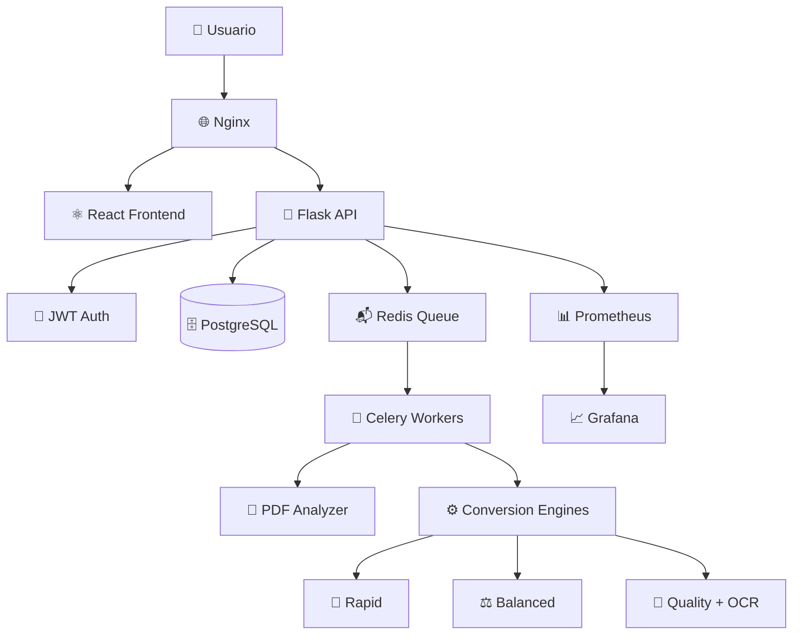

# 📚 Anclora PDF2EPUB

> **Sistema de conversión inteligente de documentos PDF a formato EPUB3 con IA integrada**

[](https://opensource.org/licenses/MIT)
[](https://www.docker.com/)
[](https://www.python.org/)
[](https://reactjs.org/)
[](https://www.typescriptlang.org/)

Anclora PDF2EPUB es una aplicación web empresarial que revoluciona la conversión de documentos PDF a EPUB3 mediante análisis inteligente con IA y motores de conversión especializados. Diseñada para editores digitales, instituciones educativas y desarrolladores que requieren conversiones de alta calidad y escalabilidad.

## ✨ Características Principales

### 🧠 **Análisis Inteligente con IA**
- Detección automática de 6 tipos de contenido diferentes
- Análisis de complejidad con score 1-5
- Recomendación automática del motor óptimo
- Detección de idioma y elementos especiales

### 🚀 **Motores de Conversión Especializados**
- **Rapid Engine**: Documentos simples (2-5 segundos)
- **Balanced Engine**: Documentos mixtos (10-30 segundos)
- **Quality Engine**: Documentos complejos con OCR (30-120 segundos)

### 📊 **Transparencia Total**
- Métricas detalladas de calidad en tiempo real
- Logs estructurados para auditoría
- Dashboard de monitoreo con Prometheus + Grafana
- Historial completo de conversiones

### ⚡ **Arquitectura Cloud-Ready**
- Microservicios escalables con Docker
- Procesamiento asíncrono con Celery
- Base de datos PostgreSQL para alta concurrencia
- API REST completa con autenticación JWT

### 🎨 **Experiencia de Usuario Moderna**
- Interfaz React + TypeScript responsive
- Tema claro/oscuro con persistencia
- Drag & drop con validación en tiempo real
- Descarga automática de resultados

## 🏗️ Arquitectura del Sistema


## 🚀 Inicio Rápido

### Requisitos Previos

- **Docker** y **Docker Compose** (requerido)
- **Git** para clonar el repositorio
- **Node.js 18+** (solo para desarrollo local)
- **Python 3.11+** (solo para desarrollo local)

### Instalación con Docker (Recomendado)

1. **Clonar el repositorio:**
```bash
git clone https://github.com/ToniIAPro73/Anclora-PDF2EPUB-Claude.git
cd Anclora-PDF2EPUB-Claude
```

2. **Configurar variables de entorno:**
```bash
# Crear archivo .env en la raíz del proyecto
cp .env.example .env
```

Contenido del archivo `.env`:
```env
# Configuración de puertos
FRONTEND_PORT=3003
BACKEND_PORT=5175
NGINX_PORT=80
WORKER_METRICS_PORT=8001

# Configuración de Redis
REDIS_PORT=6379
REDIS_PASSWORD=anclora_redis_password

# Configuración de PostgreSQL
POSTGRES_DB=anclora_pdf2epub
POSTGRES_USER=anclora_user
POSTGRES_PASSWORD=anclora_password
POSTGRES_PORT=5432

# Configuración de la aplicación
FLASK_ENV=production
FLASK_APP=app
SECRET_KEY=your_super_secret_key_here
JWT_SECRET=your_jwt_secret_here
JWT_EXPIRATION=3600

# Configuración de almacenamiento
UPLOAD_FOLDER=uploads
RESULTS_FOLDER=results

# Configuración de recursos
MAX_WORKERS=4
CONVERSION_TIMEOUT=300
```

3. **Iniciar todos los servicios:**
```bash
docker-compose up -d
```

4. **Verificar que todos los servicios estén ejecutándose:**
```bash
docker-compose ps
```

5. **Acceder a la aplicación:**
- **Aplicación principal**: http://localhost
- **Frontend directo**: http://localhost:3003
- **API Backend**: http://localhost:5175/api
- **Grafana Dashboard**: http://localhost:3000 (admin/admin)
- **Prometheus Metrics**: http://localhost:9090

### Primer Uso

1. **Registrar un usuario:**
```bash
curl -X POST http://localhost/api/auth/register \
  -H 'Content-Type: application/json' \
  -d '{"username":"admin","password":"admin123"}'
```

2. **Iniciar sesión:**
```bash
curl -X POST http://localhost/api/auth/login \
  -H 'Content-Type: application/json' \
  -d '{"username":"admin","password":"admin123"}'
```

3. **Usar la interfaz web:**
   - Navegar a http://localhost
   - Iniciar sesión con las credenciales creadas
   - Subir un archivo PDF y comenzar la conversión
## 🛠️ Desarrollo Local

### Frontend (React + TypeScript)

```bash
cd frontend
npm install
npm run dev
```
El servidor de desarrollo iniciará en http://localhost:3003

### Backend (Flask + Celery)

```bash
cd backend
python -m venv venv
source venv/bin/activate  # En Windows: venv\Scripts\activate
pip install -r requirements.txt
flask run --port=5175
```

### Worker de Celery

```bash
cd backend
celery -A app.celery worker --loglevel=info
```

### Servicios Auxiliares

```bash
# Redis (requerido para Celery)
docker run -d -p 6379:6379 redis:7-alpine

# PostgreSQL (requerido para persistencia)
docker run -d -p 5432:5432 -e POSTGRES_DB=anclora_pdf2epub -e POSTGRES_USER=anclora_user -e POSTGRES_PASSWORD=anclora_password postgres:15
```

## 🧪 Testing

### Tests Backend
```bash
cd backend
pytest tests/ -v
```

### Tests Frontend
```bash
cd frontend
npm test
```

### Tests de Integración
```bash
# Con Docker Compose ejecutándose
cd backend
pytest tests/integration/ -v
```

## 📡 API Reference

### Autenticación

| Endpoint | Método | Descripción |
|----------|--------|-------------|
| `/api/auth/register` | POST | Registrar nuevo usuario |
| `/api/auth/login` | POST | Iniciar sesión y obtener JWT |

### Conversión

| Endpoint | Método | Descripción | Auth |
|----------|--------|-------------|------|
| `/api/analyze` | POST | Analizar PDF y obtener recomendaciones | ✅ |
| `/api/convert` | POST | Iniciar conversión PDF→EPUB | ✅ |
| `/api/status/<task_id>` | GET | Obtener estado de conversión | ✅ |
| `/api/history` | GET | Historial de conversiones | ✅ |

### Monitoreo

| Endpoint | Método | Descripción |
|----------|--------|-------------|
| `/metrics` | GET | Métricas Prometheus |
| `/health` | GET | Health check |

### Ejemplo de Uso de API

```bash
# 1. Registrar usuario
curl -X POST http://localhost/api/auth/register \
  -H 'Content-Type: application/json' \
  -d '{"username":"testuser","password":"testpass123"}'

# 2. Obtener token
TOKEN=$(curl -X POST http://localhost/api/auth/login \
  -H 'Content-Type: application/json' \
  -d '{"username":"testuser","password":"testpass123"}' | jq -r '.token')

# 3. Analizar PDF
curl -X POST http://localhost/api/analyze \
  -H "Authorization: Bearer $TOKEN" \
  -F "file=@document.pdf"

# 4. Convertir PDF
curl -X POST http://localhost/api/convert \
  -H "Authorization: Bearer $TOKEN" \
  -F "file=@document.pdf" \
  -F "pipeline_id=balanced"
```

## 📁 Estructura del Proyecto

```
anclora-pdf2epub/
├── 📁 frontend/                    # Aplicación React + TypeScript
│   ├── 📁 public/                  # Archivos estáticos
│   ├── 📁 src/
│   │   ├── 📁 components/          # Componentes React
│   │   │   ├── ConversionPanel.tsx # Panel de conversión
│   │   │   ├── FileUploader.tsx    # Subida de archivos
│   │   │   ├── ConversionHistory.tsx # Historial
│   │   │   └── MetricsDisplay.tsx  # Métricas
│   │   ├── App.tsx                 # Componente principal
│   │   ├── AuthContext.tsx         # Context de autenticación
│   │   └── index.tsx               # Punto de entrada
│   ├── package.json                # Dependencias npm
│   ├── tsconfig.json               # Configuración TypeScript
│   └── vite.config.js              # Configuración Vite
│
├── 📁 backend/                     # API Flask + Celery
│   ├── 📁 app/
│   │   ├── __init__.py             # Factory Flask
│   │   ├── routes.py               # Endpoints API REST
│   │   ├── tasks.py                # Tareas Celery asíncronas
│   │   ├── converter.py            # Motores de conversión
│   │   ├── pipeline.py             # Pipeline de procesamiento
│   │   ├── auth.py                 # Autenticación JWT
│   │   └── models.py               # Modelos SQLAlchemy
│   ├── 📁 tests/                   # Tests unitarios/integración
│   └── requirements.txt            # Dependencias Python
│
├── 📁 docker/                      # Configuración Docker
│   ├── 📁 nginx/
│   │   └── nginx.conf              # Proxy reverso
│   ├── Dockerfile.frontend         # Imagen Docker frontend
│   └── Dockerfile.backend          # Imagen Docker backend
│
├── 📁 docs/                        # Documentación
│   └── ANALISIS_TECNICO_COMPLETO_ANCLORA.md
│
├── .env                            # Variables de entorno
├── docker-compose.yml              # Orquestación 7 servicios
├── README.md                       # Esta documentación
└── .gitignore                      # Archivos ignorados por Git
```
Uso del Sistema
1. Subir un PDF

Arrastra y suelta un archivo PDF en la zona de carga o haz clic para seleccionarlo
Se realizará un análisis automático del documento para detectar su complejidad y recomendaciones

2. Iniciar Conversión

Una vez subido el archivo, presiona el botón "Iniciar Conversión"
El sistema seleccionará automáticamente el motor de conversión óptimo según la complejidad detectada
Puedes ver el progreso en tiempo real con detalles de cada etapa

3. Descargar el EPUB

Al completar la conversión, se mostrarán métricas de calidad
El botón "Descargar EPUB" te permitirá guardar el archivo convertido
También puedes ver una vista previa del resultado antes de descargar

Motores de Conversión
El sistema utiliza tres motores especializados:

Motor Rápido (Rapid)

Para documentos simples basados principalmente en texto
Tiempo típico: 3-5 segundos
Mejor para: artículos, documentos sencillos


Motor Balanceado (Balanced)

Para documentos mixtos con texto e imágenes
Tiempo típico: 8-12 segundos
Mejor para: informes, presentaciones, documentos generales


Motor de Máxima Calidad (Quality)

Para documentos complejos o escaneados que requieren OCR
Tiempo típico: 15-25 segundos
Mejor para: libros, documentos escaneados, documentos técnicos con fórmulas


Configuración Avanzada
Personalización de Puertos
Modifica los valores en el archivo .env para cambiar los puertos:
envFRONTEND_PORT=3003    # Puerto para el frontend React
BACKEND_PORT=5175     # Puerto para la API Flask
NGINX_PORT=80         # Puerto para Nginx
WORKER_METRICS_PORT=8001 # Puerto métricas del worker
Escalado de Workers
Para ajustar el número de workers de Celery y mejorar el rendimiento en conversiones paralelas:
yaml# En docker-compose.yml
worker:
  deploy:
    replicas: 4  # Ajusta según tus necesidades
Solución de Problemas
Problemas Comunes y Soluciones

Los contenedores no inician correctamente

bash   # Verificar logs
   docker-compose logs
   
   # Reiniciar servicios
   docker-compose restart

Error en la conversión de PDFs escaneados

Asegúrate de que el OCR esté correctamente configurado
Verifica que el documento escaneado tenga suficiente calidad


Problemas de permisos en volúmenes Docker

bash   # Corregir permisos
   sudo chown -R 1000:1000 ./backend/uploads ./backend/results
Roadmap

✅ Versión MVP con soporte básico PDF → EPUB
✅ Integración de OCR para documentos escaneados
✅ Análisis automático con IA
⏳ Vista previa EPUB integrada
⏳ Panel analytics con KPIs detallados
⏳ Optimizaciones rendimiento OCR
🔜 Sistema autenticación OAuth
🔜 Internacionalización (español, inglés, francés)

Contribuir

Haz un fork del repositorio
Crea una rama para tu función (git checkout -b feature/amazing-feature)
Haz commit de tus cambios (git commit -m 'Add amazing feature')
Push a la rama (git push origin feature/amazing-feature)
Abre un Pull Request

Licencia
MIT
Equipo

Desarrollado por el equipo Anclora
Contacto: equipo@anclora.com


Anclora PDF2EPUB - Parte del ecosistema Anclora para gestión y transformación inteligente de documentos digitales.