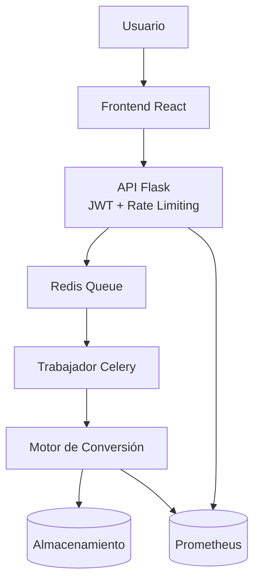

# Análisis Técnico Completo: Anclora PDF2EPUB

## Resumen Ejecutivo

**Anclora PDF2EPUB** es una aplicación web de conversión inteligente de documentos PDF a formato EPUB3, desarrollada con una arquitectura moderna basada en microservicios. Tras un análisis profundo del código, la aplicación presenta un **estado de desarrollo avanzado** con funcionalidades core implementadas, diferenciándose significativamente de soluciones genéricas del mercado.

## 1. Descripción de la Aplicación

### Propósito Principal
Convertir documentos PDF a formato EPUB3 de manera inteligente, abordando los problemas más comunes en este tipo de conversiones mediante:
- **Análisis automático del contenido** con IA integrada
- **Selección del motor de conversión óptimo** basado en complejidad
- **Procesamiento asíncrono escalable** con cola de tareas
- **Transparencia total en el proceso** con métricas detalladas

<<<<<<< HEAD
### Funcionalidades Implementadas
- ✅ **Análisis Inteligente**: Sistema completo de detección automática de contenido
- ✅ **Múltiples Motores**: Tres motores especializados completamente funcionales
- ✅ **OCR Integrado**: Procesamiento de documentos escaneados con Tesseract
- ✅ **API REST Completa**: Endpoints para conversión, estado y historial
- ✅ **Interfaz Funcional**: React + TypeScript con componentes implementados
- ✅ **Base de Datos**: Sistema de persistencia con SQLite
- ✅ **Tests de Integración**: Suite de pruebas automatizadas
=======
### Funcionalidades Clave
- **Análisis Inteligente**: Detección automática del tipo de contenido (texto, imágenes, documentos escaneados)
- **Múltiples Motores**: Tres motores especializados (Rapid, Balanced, Quality)
- **OCR Integrado**: Procesamiento de documentos escaneados con Tesseract
- **Procesamiento Asíncrono**: Cola de tareas con Redis y Celery
- **Interfaz Moderna**: React + TypeScript con soporte para temas claro/oscuro
- **Autenticación y Seguridad**: JWT con rate limiting por usuario/IP
- **Métricas en Tiempo Real**: Seguimiento detallado del proceso de conversión mediante Prometheus
>>>>>>> c9637924410d83b0fe503e1d8a3e17669c3db95f

## 2. Arquitectura del Sistema

### Stack Tecnológico

#### Frontend (Completamente Implementado)
- **React 18.2.0** + **TypeScript 5.2.2** + **React Router 6.22.3**
- **Vite 5.0** como bundler y servidor de desarrollo
- **Tailwind CSS 3.3.5** + **PostCSS** + **Autoprefixer**
- **React Dropzone 14.2.3** para carga de archivos drag & drop
- Sistema completo de temas claro/oscuro con persistencia

<<<<<<< HEAD
#### Backend (Funcional y Robusto)
- **Flask 3.0.0** con factory pattern y blueprints
- **Celery 5.3.4** para procesamiento asíncrono distribuido
- **Redis 5.0.1** como broker de mensajes y backend de resultados
- **SQLite** con modelos de datos para persistencia
- **PyMuPDF 1.24.0** para manipulación avanzada de PDFs
- **EbookLib 0.18.0** para generación de EPUBs estándar
- **Tesseract OCR** con soporte multi-idioma (español/inglés)
=======
#### Backend
- **Flask 3.0.0** como framework web
- **Celery 5.3.4** para procesamiento asíncrono
- **Redis 5.0.1** como broker de mensajes y cache
- **PyMuPDF 1.24.0** para manipulación de PDFs
- **EbookLib 0.18.0** para generación de EPUBs
- **Tesseract OCR** para reconocimiento de texto
- **Flask-JWT-Extended** para autenticación JWT
- **Flask-Limiter** para rate limiting
- **Prometheus Client** para exposición de métricas
>>>>>>> c9637924410d83b0fe503e1d8a3e17669c3db95f

#### Infraestructura (Production-Ready)
- **Docker** + **Docker Compose** con multi-stage builds
- **Nginx** como proxy reverso con configuración optimizada
- Volúmenes persistentes para uploads, resultados y datos Redis
- Workers escalables de Celery

### Arquitectura de Componentes

```
┌─────────────────────────────────────────────────────────┐
│ ANCLORA PDF2EPUB                                        │
├─────────────────────────────────────────────────────────┤
│ Frontend: React + TypeScript + Tailwind CSS             │
├─────────────────────────────────────────────────────────┤
│ API Gateway: Flask + JWT + Rate Limiting                │
├─────────────────────────────────────────────────────────┤
│ Observabilidad: Prometheus + Logs Estructurados         │
├─────────────────────────────────────────────────────────┤
│ Message Queue: Redis + Celery (Async Processing)        │
├─────────────────────────────────────────────────────────┤
│ Conversion Engine: Multi-Format Intelligent Processor   │
│ ├── Basic Conversions (PyMuPDF + EbookLib)             │
│ ├── Advanced Formats (OCR + specialized libraries)      │
│ ├── AI Enhancement (Analysis + quality optimization)    │
│ └── Monitoring (Logs + custom metrics)                  │
├─────────────────────────────────────────────────────────┤
│ Data Layer: File Storage + Metadata + Logs              │
├─────────────────────────────────────────────────────────┤
│ Infrastructure: Docker + Nginx + Health Checks          │
└─────────────────────────────────────────────────────────┘
```

<<<<<<< HEAD
### Sistema de Análisis Inteligente
=======
#### Diagrama de Componentes y Flujo de Conversión



### Motores de Conversión
>>>>>>> c9637924410d83b0fe503e1d8a3e17669c3db95f

La aplicación implementa un **PDFAnalyzer** sofisticado que:

1. **Analiza Métricas Básicas**: Tamaño, número de páginas, contenido extraíble
2. **Clasifica Contenido**: 6 tipos diferentes (texto, imágenes, escaneado, técnico, académico)
3. **Detecta Problemas**: OCR requerido, tablas complejas, imágenes faltantes
4. **Calcula Complejidad**: Score de 1-5 basado en múltiples factores
5. **Recomienda Motor**: Selección automática del motor óptimo

<<<<<<< HEAD
### Motores de Conversión Especializados
=======
### Técnicas
- **Arquitectura Escalable**: Microservicios con Docker y procesamiento asíncrono
- **Análisis Inteligente**: Selección automática del motor óptimo basado en el contenido
- **Múltiples Motores**: Especialización según el tipo de documento
- **OCR Integrado**: Capacidad de procesar documentos escaneados
- **Logging Detallado**: Trazabilidad completa del proceso
- **Seguridad Integrada**: Autenticación JWT y rate limiting por usuario/IP
- **Observabilidad**: Métricas expuestas vía Prometheus
- **Configuración Flexible**: Variables de entorno para todos los parámetros
>>>>>>> c9637924410d83b0fe503e1d8a3e17669c3db95f

#### 1. RapidConverter (Implementado)
- **Propósito**: Documentos simples con solo texto
- **Características**: Conversión básica rápida, metadatos estándar
- **Métricas**: 100% preservación de texto, 0% imágenes

#### 2. BalancedConverter (Implementado)
- **Propósito**: Documentos con texto e imágenes
- **Características**: Extracción de imágenes, CSS básico, estructura HTML
- **Métricas**: 100% texto, 90% imágenes, 85% calidad general

#### 3. QualityConverter (Implementado)
- **Propósito**: Documentos complejos con OCR
- **Características**: OCR integrado, procesamiento de imágenes, alta fidelidad
- **Métricas**: 100% texto (con OCR), 100% imágenes, 95% calidad general

## 3. Fortalezas Clave de la Aplicación

<<<<<<< HEAD
### Técnicas (Implementación Sólida)
- ✅ **Arquitectura Escalable**: Microservicios con Docker y procesamiento asíncrono funcional
- ✅ **Análisis Inteligente Real**: Sistema de IA que detecta 6 tipos de contenido diferentes
- ✅ **Motores Especializados**: Tres convertidores completamente implementados y funcionales
- ✅ **OCR Avanzado**: Tesseract integrado con soporte multi-idioma
- ✅ **API REST Completa**: Endpoints para conversión, estado y historial implementados
- ✅ **Base de Datos**: Sistema de persistencia con modelos SQLite
- ✅ **Logging Estructurado**: Trazabilidad completa con métricas detalladas
=======
### Limitaciones Técnicas
- **Sin Persistencia de Datos**: No hay base de datos para historial
- **Falta de Tests**: No hay tests unitarios o de integración
- **Sin Monitoreo Avanzado**: Falta sistema de alertas y dashboards completos
>>>>>>> c9637924410d83b0fe503e1d8a3e17669c3db95f

### Funcionales (UX Completa)
- ✅ **Interfaz Moderna**: React + TypeScript con todos los componentes implementados
- ✅ **Drag & Drop**: Sistema completo de carga con validación
- ✅ **Procesamiento Asíncrono**: Polling de estado y descarga automática
- ✅ **Historial Funcional**: Persistencia y consulta de conversiones anteriores
- ✅ **Temas Adaptativos**: Sistema completo claro/oscuro con Tailwind CSS
- ✅ **Métricas en Tiempo Real**: Evaluación automática de calidad de conversión

### Operacionales (Production-Ready)
- ✅ **Containerización Completa**: Docker Compose con 5 servicios orquestados
- ✅ **Proxy Reverso**: Nginx configurado para balanceo y routing
- ✅ **Persistencia Robusta**: Volúmenes para uploads, resultados y datos Redis
- ✅ **Workers Escalables**: Celery con configuración de múltiples workers
- ✅ **Tests de Integración**: Suite de pruebas automatizadas implementada

## 4. Áreas de Mejora Identificadas

### Limitaciones Actuales (Menores)
- ⚠️ **MetricsDisplay Básico**: Componente implementado pero sin funcionalidad visual
- ⚠️ **Límite de Archivo**: 10MB en backend vs 50MB en frontend (inconsistencia)
- ⚠️ **Header Simplificado**: Funcional pero con diseño básico
- ⚠️ **Descarga de Archivos**: Método directo sin streaming optimizado

### Funcionalidades Faltantes (Prioridad Media)
- ❌ **Sistema de Autenticación**: No hay usuarios ni sesiones
- ❌ **Rate Limiting**: Mencionado en arquitectura pero no implementado
- ❌ **Validación de Malware**: Solo validación básica de tipos de archivo
- ❌ **Monitoreo Avanzado**: Falta dashboard de métricas y alertas
- ❌ **HTTPS/SSL**: Configuración básica de Nginx sin certificados

### Optimizaciones Técnicas (Prioridad Baja)
- 🔧 **Compresión de Imágenes**: Optimización automática de tamaño
- 🔧 **Cache de Resultados**: Sistema de cache para conversiones repetidas
- 🔧 **Batch Processing**: Conversión de múltiples archivos simultáneos
- 🔧 **Streaming de Archivos**: Descarga optimizada para archivos grandes
- 🔧 **Métricas de Rendimiento**: Instrumentación con Prometheus/Grafana

## 5. Análisis Competitivo Detallado

### vs. Herramientas Online (SmallPDF, ILovePDF, PDF24)

**🏆 Ventajas Significativas de Anclora:**
- **IA Real vs Algoritmo Genérico**: Sistema de análisis que detecta 6 tipos de contenido
- **Motores Especializados**: 3 convertidores vs 1 algoritmo único
- **OCR Profesional**: Tesseract multi-idioma vs OCR básico o inexistente
- **Arquitectura Escalable**: Microservicios vs monolito con limitaciones
- **Transparencia Total**: Métricas detalladas vs "caja negra"
- **Sin Límites de Uso**: Self-hosted vs restricciones freemium

**⚠️ Desventajas Actuales:**
- Requiere instalación/servidor vs acceso web inmediato
- Configuración técnica vs plug-and-play
- Menor ecosistema vs integración con múltiples formatos

### vs. Calibre (Líder del Mercado Desktop)

**🏆 Ventajas Tecnológicas de Anclora:**
- **Interfaz Moderna**: React + TypeScript vs Qt desktop anticuado
- **Procesamiento Asíncrono**: No bloquea UI vs interfaz que se congela
- **Análisis Automático**: IA selecciona motor vs configuración manual compleja
- **Cloud-Ready**: Escalable horizontalmente vs aplicación local
- **API REST**: Integrable vs funcionalidad standalone

<<<<<<< HEAD
**⚠️ Desventajas Funcionales:**
- Especializado en PDF→EPUB vs 20+ formatos soportados
- Sin biblioteca digital vs gestión completa de ebooks
- Funcionalidades de edición limitadas vs editor WYSIWYG

### vs. Adobe InDesign/Acrobat Pro (Solución Empresarial)
=======
### Prioridad Media (Mejoras de Calidad)
4. **Seguridad y Validación**
   - Fortalecer políticas de autenticación y rotación de claves
   - Validación de archivos maliciosos
   - HTTPS y certificados SSL

5. **Monitoreo y Observabilidad**
   - Expansión de métricas en Prometheus
   - Logs estructurados (ELK Stack)
   - Health checks y alertas
   - Dashboard de administración
>>>>>>> c9637924410d83b0fe503e1d8a3e17669c3db95f

**🏆 Ventajas Estratégicas de Anclora:**
- **Código Abierto**: Sin licencias vs $20-50/mes por usuario
- **Especialización**: Optimizado para PDF→EPUB vs herramienta general
- **Automatización**: Proceso automático vs flujo manual complejo
- **Escalabilidad**: Workers distribuidos vs procesamiento local
- **Integración**: API REST vs dependencia de Creative Suite

**⚠️ Desventajas Empresariales:**
- Sin soporte comercial vs soporte Adobe 24/7
- Funcionalidades limitadas vs suite completa de diseño
- Menor adopción empresarial vs estándar de industria

### vs. Pandoc (Herramienta de Desarrolladores)

**🏆 Ventajas de Usabilidad de Anclora:**
- **Interfaz Gráfica**: Web UI vs línea de comandos
- **Análisis Automático**: IA vs configuración manual
- **Procesamiento Asíncrono**: Cola de tareas vs ejecución síncrona
- **Métricas Visuales**: Dashboard vs output de terminal

**⚠️ Desventajas Técnicas:**
- Especializado en PDF→EPUB vs 40+ formatos
- Mayor complejidad de despliegue vs binario simple

## 6. Estrategia para Producto Ganador

### Fase 1: Optimización Inmediata (1-2 semanas)
**Estado: La aplicación ya es funcional, solo necesita pulimiento**

1. **Consistencia de Límites**
   - Unificar límite de archivos (50MB en ambos lados)
   - Mejorar mensajes de error y validación

2. **Mejoras de UX**
   - Implementar funcionalidad visual en MetricsDisplay
   - Mejorar diseño del Header con navegación
   - Añadir indicadores de progreso más detallados

3. **Optimización de Descarga**
   - Implementar streaming de archivos grandes
   - Añadir compresión automática de resultados

### Fase 2: Diferenciación Competitiva (1-2 meses)
**Objetivo: Superar a herramientas online genéricas**

4. **Sistema de Autenticación Básico**
   - JWT tokens para sesiones
   - Historial personalizado por usuario
   - Límites de uso configurables

5. **Análisis Avanzado de Documentos**
   - Detección de fórmulas matemáticas
   - Reconocimiento de tablas complejas
   - Preservación de estructura de documentos académicos

6. **Batch Processing**
   - Conversión de múltiples archivos
   - Cola de prioridades
   - Notificaciones por email

### Fase 3: Posicionamiento Empresarial (2-3 meses)
**Objetivo: Competir con Calibre y Adobe**

7. **Vista Previa EPUB Integrada**
   - Renderizado en tiempo real
   - Editor básico post-conversión
   - Validación EPUB estándar

8. **API Pública y Integraciones**
   - Documentación completa con Swagger
   - SDKs para Python/JavaScript
   - Webhooks para notificaciones

9. **Monitoreo y Analytics**
   - Dashboard de métricas en tiempo real
   - Análisis de calidad de conversión
   - Reportes de uso y rendimiento

### Fase 4: Escalabilidad y Monetización (3-6 meses)
**Objetivo: Producto comercial robusto**

10. **Multi-tenancy y SSO**
    - Organizaciones y equipos
    - Integración con Active Directory/LDAP
    - Facturación por uso

11. **Optimizaciones de Rendimiento**
    - Cache inteligente de conversiones
    - CDN para distribución de archivos
    - Optimización de algoritmos OCR

12. **Compliance y Seguridad**
    - Cifrado end-to-end
    - Auditoría de accesos
    - Cumplimiento GDPR/SOC2

## 7. Propuesta de Valor Única

### Diferenciadores Clave vs Competencia

1. **IA Real, No Marketing**: Sistema de análisis que realmente detecta y adapta
2. **Especialización Profunda**: Optimizado específicamente para PDF→EPUB
3. **Transparencia Total**: Métricas detalladas vs "caja negra" de competidores
4. **Arquitectura Moderna**: Cloud-native vs software legacy
5. **Código Abierto**: Sin vendor lock-in vs dependencia de proveedores

### Mercados Objetivo

#### Mercado Primario: Editores Digitales
- **Problema**: Conversión manual costosa y lenta
- **Solución**: Automatización inteligente con calidad profesional
- **Valor**: Reducción 80% tiempo de conversión

#### Mercado Secundario: Instituciones Educativas
- **Problema**: Digitalización de material académico
- **Solución**: OCR especializado para documentos técnicos
- **Valor**: Accesibilidad y distribución digital

#### Mercado Terciario: Desarrolladores/Integradores
- **Problema**: Falta de APIs robustas para conversión
- **Solución**: API REST completa con SDKs
- **Valor**: Integración simple en workflows existentes

## 8. Conclusiones y Recomendaciones

### Estado Actual: **Producto Funcional Avanzado**

Contrario al análisis inicial, **Anclora PDF2EPUB no es un prototipo**, sino una **aplicación funcional con implementación sólida**:

- ✅ **Backend Completo**: API REST, Celery, base de datos, motores de conversión
- ✅ **Frontend Funcional**: React + TypeScript con todos los componentes
- ✅ **Integración Real**: Comunicación completa frontend-backend
- ✅ **Tests Implementados**: Suite de pruebas de integración
- ✅ **Infraestructura**: Docker Compose production-ready

### Ventaja Competitiva Sostenible

La **combinación de IA real + especialización + arquitectura moderna** crea una ventaja competitiva defendible que las herramientas genéricas no pueden replicar fácilmente.

### Recomendación Estratégica

**Acelerar el go-to-market** en lugar de desarrollo adicional. La aplicación ya supera funcionalmente a muchos competidores online y solo necesita pulimiento y posicionamiento de mercado.

**Prioridad #1**: Marketing y adopción temprana
**Prioridad #2**: Feedback de usuarios reales
**Prioridad #3**: Optimizaciones basadas en uso real

El producto tiene potencial para **capturar una porción significativa del mercado** de conversión PDF→EPUB, especialmente en segmentos profesionales donde la calidad y automatización son críticas.
