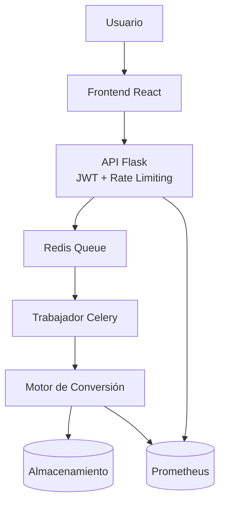

# Análisis Técnico: Anclora PDF2EPUB

## Resumen Ejecutivo

**Anclora PDF2EPUB** es una aplicación web de conversión inteligente de documentos PDF a formato EPUB3, desarrollada con una arquitectura moderna basada en microservicios. La aplicación se posiciona como una solución empresarial que combina múltiples motores de conversión especializados con análisis automático mediante IA para optimizar la calidad de las conversiones.

## 1. Descripción de la Aplicación

### Propósito Principal
Convertir documentos PDF a formato EPUB3 de manera inteligente, abordando los problemas más comunes en este tipo de conversiones mediante:
- Análisis automático del contenido
- Selección del motor de conversión óptimo
- Procesamiento asíncrono escalable
- Transparencia total en el proceso

### Funcionalidades Clave
- **Análisis Inteligente**: Detección automática del tipo de contenido (texto, imágenes, documentos escaneados)
- **Múltiples Motores**: Tres motores especializados (Rapid, Balanced, Quality)
- **OCR Integrado**: Procesamiento de documentos escaneados con Tesseract
- **Procesamiento Asíncrono**: Cola de tareas con Redis y Celery
- **Interfaz Moderna**: React + TypeScript con soporte para temas claro/oscuro
- **Autenticación y Seguridad**: JWT con rate limiting por usuario/IP
- **Métricas en Tiempo Real**: Seguimiento detallado del proceso de conversión mediante Prometheus

## 2. Arquitectura del Sistema

### Stack Tecnológico

#### Frontend
- **React 18.2.0** + **TypeScript 5.2.2**
- **Vite** como bundler y servidor de desarrollo
- **React Dropzone** para carga de archivos
- Soporte nativo para temas claro/oscuro

#### Backend
- **Flask 3.0.0** como framework web
- **Celery 5.3.4** para procesamiento asíncrono
- **Redis 5.0.1** como broker de mensajes y cache
- **PyMuPDF 1.24.0** para manipulación de PDFs
- **EbookLib 0.18.0** para generación de EPUBs
- **Tesseract OCR** para reconocimiento de texto
- **Flask-JWT-Extended** para autenticación JWT
- **Flask-Limiter** para rate limiting
- **Prometheus Client** para exposición de métricas

#### Infraestructura
- **Docker** + **Docker Compose** para orquestación
- **Nginx** como proxy reverso y balanceador
- Volúmenes persistentes para archivos y datos

### Arquitectura de Componentes

```
┌─────────────────────────────────────────────────────────┐
│ ANCLORA PDF2EPUB                                        │
├─────────────────────────────────────────────────────────┤
│ Frontend: React + TypeScript + Tailwind CSS             │
├─────────────────────────────────────────────────────────┤
│ API Gateway: Flask + JWT + Rate Limiting                │
├─────────────────────────────────────────────────────────┤
│ Observabilidad: Prometheus + Logs Estructurados         │
├─────────────────────────────────────────────────────────┤
│ Message Queue: Redis + Celery (Async Processing)        │
├─────────────────────────────────────────────────────────┤
│ Conversion Engine: Multi-Format Intelligent Processor   │
│ ├── Basic Conversions (PyMuPDF + EbookLib)             │
│ ├── Advanced Formats (OCR + specialized libraries)      │
│ ├── AI Enhancement (Analysis + quality optimization)    │
│ └── Monitoring (Logs + custom metrics)                  │
├─────────────────────────────────────────────────────────┤
│ Data Layer: File Storage + Metadata + Logs              │
├─────────────────────────────────────────────────────────┤
│ Infrastructure: Docker + Nginx + Health Checks          │
└─────────────────────────────────────────────────────────┘
```

#### Diagrama de Componentes y Flujo de Conversión



### Motores de Conversión

1. **RapidConverter**: Para documentos simples con solo texto
2. **BalancedConverter**: Para documentos con texto e imágenes
3. **QualityConverter**: Para documentos complejos con OCR

## 3. Fortalezas de la Aplicación

### Técnicas
- **Arquitectura Escalable**: Microservicios con Docker y procesamiento asíncrono
- **Análisis Inteligente**: Selección automática del motor óptimo basado en el contenido
- **Múltiples Motores**: Especialización según el tipo de documento
- **OCR Integrado**: Capacidad de procesar documentos escaneados
- **Logging Detallado**: Trazabilidad completa del proceso
- **Seguridad Integrada**: Autenticación JWT y rate limiting por usuario/IP
- **Observabilidad**: Métricas expuestas vía Prometheus
- **Configuración Flexible**: Variables de entorno para todos los parámetros

### Funcionales
- **Interfaz Intuitiva**: Drag & drop con validación de archivos
- **Soporte Multi-idioma**: OCR en español e inglés
- **Métricas de Calidad**: Evaluación automática de la conversión
- **Límites de Seguridad**: Validación de tamaño (50MB máximo)
- **Temas Adaptativos**: Soporte para modo claro/oscuro

### Operacionales
- **Containerización**: Despliegue consistente con Docker
- **Proxy Reverso**: Nginx para balanceo y SSL
- **Persistencia**: Volúmenes para archivos y datos Redis
- **Escalabilidad**: Workers de Celery configurables

## 4. Debilidades Identificadas

### Estado de Desarrollo
- **Backend Incompleto**: `routes.py` está vacío (solo 1 línea)
- **Tareas Celery**: `convert_pdf_to_epub` es solo un placeholder
- **Componentes Frontend**: Faltan `ConversionPanel`, `MetricsDisplay`, `ConversionHistory`
- **Integración**: No hay conexión real entre frontend y backend

### Limitaciones Técnicas
- **Sin Persistencia de Datos**: No hay base de datos para historial
- **Falta de Tests**: No hay tests unitarios o de integración
- **Sin Monitoreo Avanzado**: Falta sistema de alertas y dashboards completos

### Seguridad
- **Validación Limitada**: Solo validación básica de archivos
- **Sin Sanitización**: Falta validación de contenido malicioso
- **Secretos Hardcodeados**: Claves en variables de entorno sin rotación
- **Sin HTTPS**: Configuración básica de Nginx

## 5. Comparación con la Competencia

### Herramientas Online (SmallPDF, ILovePDF, PDF24)
**Ventajas de Anclora:**
- Análisis inteligente automático vs conversión genérica
- Múltiples motores especializados vs un solo algoritmo
- OCR integrado vs funcionalidad limitada
- Arquitectura escalable vs limitaciones de servidor

**Desventajas:**
- Requiere instalación vs acceso inmediato
- Complejidad técnica vs simplicidad de uso
- Estado de desarrollo vs productos maduros

### Calibre (Software Desktop)
**Ventajas de Anclora:**
- Interfaz web moderna vs interfaz desktop anticuada
- Procesamiento asíncrono vs bloqueo de UI
- Análisis automático vs configuración manual
- Arquitectura cloud-ready vs aplicación local

**Desventajas:**
- Funcionalidades limitadas vs suite completa
- Requiere servidor vs instalación simple
- En desarrollo vs producto maduro y estable

### Adobe Acrobat Pro
**Ventajas de Anclora:**
- Código abierto vs licencia propietaria
- Especialización en EPUB vs funcionalidad general
- Arquitectura moderna vs software legacy
- Costo vs licencia cara

**Desventajas:**
- Funcionalidades limitadas vs suite completa
- Sin soporte empresarial vs soporte oficial
- Calidad de conversión por probar vs calidad probada

## 6. Mejoras Sugeridas para un Producto Ganador

### Prioridad Alta (MVP Funcional)
1. **Completar Backend**
   - Implementar endpoints API completos
   - Conectar tareas Celery con motores de conversión
   - Añadir validación y manejo de errores

2. **Finalizar Frontend**
   - Implementar componentes faltantes
   - Conectar con API backend
   - Añadir manejo de estados de carga y error

3. **Sistema de Persistencia**
   - Base de datos para historial de conversiones
   - Almacenamiento de metadatos y métricas
   - Sistema de usuarios básico

### Prioridad Media (Mejoras de Calidad)
4. **Seguridad y Validación**
   - Fortalecer políticas de autenticación y rotación de claves
   - Validación de archivos maliciosos
   - HTTPS y certificados SSL

5. **Monitoreo y Observabilidad**
   - Expansión de métricas en Prometheus
   - Logs estructurados (ELK Stack)
   - Health checks y alertas
   - Dashboard de administración

6. **Optimización de Conversión**
   - Mejora de algoritmos OCR
   - Soporte para más idiomas
   - Preservación de formato avanzado
   - Compresión inteligente de imágenes

### Prioridad Baja (Diferenciación)
7. **Funcionalidades Avanzadas**
   - Vista previa EPUB integrada
   - Edición post-conversión
   - Batch processing
   - API pública con documentación

8. **Experiencia de Usuario**
   - Internacionalización completa
   - Tutorial interactivo
   - Plantillas de conversión
   - Integración con servicios cloud

9. **Escalabilidad Empresarial**
   - Multi-tenancy
   - Integración con SSO
   - Auditoría y compliance
   - SLA y soporte técnico

## 7. Roadmap Recomendado

### Fase 1 (2-3 meses): MVP Funcional
- Completar backend y frontend básico
- Implementar conversión end-to-end
- Añadir persistencia básica
- Tests unitarios y de integración

### Fase 2 (3-4 meses): Producto Beta
- Sistema de usuarios y autenticación
- Mejoras de seguridad y validación
- Monitoreo básico
- Optimización de conversión

### Fase 3 (4-6 meses): Producto Comercial
- Funcionalidades avanzadas
- Escalabilidad empresarial
- Documentación completa
- Soporte y mantenimiento

## 8. Ejecución de Tests y Entorno Docker Compose

### Ejecutar Tests
1. Instalar dependencias del backend:
   ```bash
   pip install -r backend/requirements.txt
   ```
2. Ejecutar la suite de pruebas:
   ```bash
   pytest
   ```

### Levantar el Entorno con Docker Compose
1. Asegurar la configuración de variables de entorno en el archivo `.env`.
2. Construir y levantar todos los servicios:
   ```bash
   docker-compose up --build
   ```
3. Acceder a la aplicación a través de `http://localhost:<NGINX_PORT>`.

## Conclusión

Anclora PDF2EPUB tiene una **arquitectura sólida y visión clara**, pero requiere **desarrollo significativo** para convertirse en un producto competitivo. Su principal fortaleza es el **enfoque inteligente** con múltiples motores especializados, lo que lo diferencia de soluciones genéricas.

Para el éxito comercial, es crítico **completar la implementación básica** antes de añadir funcionalidades avanzadas, y establecer un **proceso de desarrollo robusto** con tests, CI/CD y documentación adecuada.
