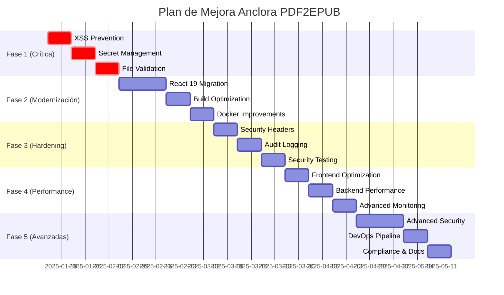

# 📋 Plan de Mejora por Fases - Anclora PDF2EPUB 2025

## 🎯 Estrategia de Implementación

Este documento presenta un **plan estructurado y priorizado** para implementar las mejoras identificadas en el análisis de seguridad. El enfoque es **incremental y de bajo riesgo**, permitiendo mantener la estabilidad del sistema mientras se implementan las mejoras.

---

## 🏃‍♂️ **FASE 1: CORRECCIONES CRÍTICAS DE SEGURIDAD** 
*Duración: 2-3 semanas | Prioridad: 🔴 CRÍTICA*

### 📅 **Sprint 1.1: Sanitización XSS** (Semana 1)

#### 🎯 **Objetivos**
- Eliminar riesgo crítico de XSS en PreviewModal
- Establecer estándares de sanitización para todo el proyecto
- Crear tests de seguridad automatizados

#### 📋 **Tareas Detalladas**

**Día 1-2: Análisis y Preparación**
- [ ] Auditar todo el código frontend para identificar usos de `dangerouslySetInnerHTML`
- [ ] Investigar alternativas a `dangerouslySetInnerHTML` para PreviewModal
- [ ] Evaluar bibliotecas de sanitización (DOMPurify vs sanitize-html)
- [ ] Crear branch de trabajo: `feature/xss-prevention`

**Día 3-4: Implementación**
- [ ] Instalar DOMPurify: `npm install dompurify @types/dompurify`
- [ ] Crear helper de sanitización en `src/utils/sanitize.ts`
- [ ] Refactorizar PreviewModal.tsx para usar sanitización
- [ ] Implementar configuración restrictiva de DOMPurify para matemáticas (KaTeX)

**Día 5: Testing y Validación**
- [ ] Crear tests unitarios para función de sanitización
- [ ] Crear tests de integración para PreviewModal
- [ ] Pruebas manuales con payloads XSS conocidos
- [ ] Documentar estándares de sanitización

**Entregables:**
- ✅ PreviewModal libre de vulnerabilidades XSS
- ✅ Utilidad de sanitización reutilizable
- ✅ Tests automatizados
- ✅ Documentación de estándares

### 📅 **Sprint 1.2: Gestión de Secretos** (Semana 2)

#### 🎯 **Objetivos**
- Eliminar secretos hardcodeados del repositorio
- Implementar rotación segura de claves
- Mejorar la seguridad de configuración

#### 📋 **Tareas Detalladas**

**Día 1-2: Auditoría y Diseño**
- [ ] Auditar todos los archivos para secretos expuestos
- [ ] Crear plan de migración de secretos
- [ ] Diseñar estructura de variables de entorno
- [ ] Evaluar soluciones de gestión de secretos (HashiCorp Vault, AWS Secrets Manager)

**Día 3-4: Implementación**
- [ ] Crear `.env.example` con valores placeholder
- [ ] Actualizar `.gitignore` para excluir archivos de secretos
- [ ] Implementar validación de configuración en startup
- [ ] Crear script de generación de claves seguras

**Día 5: Documentación y Deployment**
- [ ] Actualizar documentación de instalación
- [ ] Crear guía de deployment seguro
- [ ] Implementar health checks para configuración
- [ ] Tests de configuración en CI/CD

**Entregables:**
- ✅ Repositorio libre de secretos
- ✅ Sistema de configuración seguro
- ✅ Documentación actualizada
- ✅ Scripts de deployment seguros

### 📅 **Sprint 1.3: Validación de Archivos** (Semana 3)

#### 🎯 **Objetivos**
- Prevenir ataques de upload malicioso
- Implementar validación robusta de archivos
- Crear sistema de cuarentena para archivos sospechosos

#### 📋 **Tareas Detalladas**

**Día 1-2: Análisis de Riesgos**
- [ ] Auditar flujo actual de upload
- [ ] Identificar vectores de ataque potenciales
- [ ] Evaluar soluciones antivirus (ClamAV, VirusTotal API)
- [ ] Diseñar sistema de validación en capas

**Día 3-4: Implementación Backend**
- [ ] Implementar validación MIME type estricta
- [ ] Agregar límites configurables de tamaño
- [ ] Integrar ClamAV para escaneo antivirus
- [ ] Crear sistema de cuarentena de archivos

**Día 5: Testing y Validación**
- [ ] Tests con archivos maliciosos conocidos
- [ ] Tests de performance con archivos grandes
- [ ] Validación de edge cases
- [ ] Documentación de políticas de seguridad

**Entregables:**
- ✅ Sistema de validación multicapa
- ✅ Integración antivirus
- ✅ Tests de seguridad automatizados
- ✅ Políticas de upload documentadas

---

## ⚡ **FASE 2: MODERNIZACIÓN DE STACK**
*Duración: 3-4 semanas | Prioridad: 🟡 ALTA*

### 📅 **Sprint 2.1: Actualización React** (Semana 4-5)

#### 🎯 **Objetivos**
- Migrar a React 19 de forma segura
- Aprovechar nuevas características de performance
- Mantener compatibilidad con dependencias existentes

#### 📋 **Tareas Detalladas**

**Semana 4: Preparación y React 18.3**
- [ ] Crear branch de migración: `feature/react-19-migration`
- [ ] Actualizar a React 18.3.1 primero
- [ ] Identificar y resolver warnings de deprecación
- [ ] Actualizar @types/react y dependencias relacionadas
- [ ] Ejecutar tests completos

**Semana 5: Migración a React 19**
- [ ] Actualizar React a versión 19.x
- [ ] Migrar APIs deprecadas (forwardRef, Context.Provider)
- [ ] Actualizar ESLint rules para React 19
- [ ] Optimizar re-renders con nuevas características
- [ ] Tests extensivos y validación

**Entregables:**
- ✅ React 19 funcionando correctamente
- ✅ APIs modernas implementadas
- ✅ Performance mejorado
- ✅ Tests actualizados

### 📅 **Sprint 2.2: Optimización del Build** (Semana 6)

#### 🎯 **Objetivos**
- Actualizar tooling de build
- Optimizar tamaños de bundle
- Mejorar tiempos de desarrollo

#### 📋 **Tareas Detalladas**

**Día 1-3: Actualización Vite**
- [ ] Actualizar Vite a versión 5.x
- [ ] Migrar configuración a nuevas APIs
- [ ] Optimizar configuración de plugins
- [ ] Configurar code splitting inteligente

**Día 4-5: Optimización**
- [ ] Implementar tree shaking avanzado
- [ ] Configurar compression y minificación
- [ ] Optimizar importación de librerías
- [ ] Análisis de bundle size

**Entregables:**
- ✅ Build system modernizado
- ✅ Bundle size reducido 20%+
- ✅ Tiempo de build mejorado
- ✅ Análisis de performance

### 📅 **Sprint 2.3: Mejoras de Docker** (Semana 7)

#### 🎯 **Objetivos**
- Corregir inconsistencias en docker-compose
- Optimizar imágenes Docker
- Implementar health checks

#### 📋 **Tareas Detalladas**

**Día 1-2: Corrección de Sintaxis**
- [ ] Corregir docker-compose.yml malformado
- [ ] Estandarizar configuración de servicios
- [ ] Implementar variables de entorno consistentes
- [ ] Validar con docker-compose config

**Día 3-5: Optimización**
- [ ] Implementar multi-stage builds
- [ ] Optimizar capas de Docker
- [ ] Configurar health checks para todos los servicios
- [ ] Implementar graceful shutdown

**Entregables:**
- ✅ Docker Compose funcional
- ✅ Imágenes optimizadas
- ✅ Health checks implementados
- ✅ Documentación actualizada

---

## 🛡️ **FASE 3: HARDENING DE SEGURIDAD**
*Duración: 2-3 semanas | Prioridad: 🟡 MEDIA*

### 📅 **Sprint 3.1: Headers de Seguridad** (Semana 8)

#### 🎯 **Objetivos**
- Implementar headers de seguridad HTTP
- Configurar Content Security Policy
- Mejorar resistencia a ataques comunes

#### 📋 **Tareas Detalladas**

**Día 1-2: Análisis y Diseño**
- [ ] Auditar headers HTTP actuales
- [ ] Diseñar política CSP restrictiva
- [ ] Evaluar impacto en funcionalidad existente
- [ ] Crear configuración de Nginx segura

**Día 3-5: Implementación**
- [ ] Configurar CSP headers en Nginx
- [ ] Implementar HSTS con preload
- [ ] Configurar X-Frame-Options y X-Content-Type-Options
- [ ] Implementar CORS estricto
- [ ] Tests de compatibilidad

**Entregables:**
- ✅ Headers de seguridad completos
- ✅ CSP policy funcional
- ✅ Tests de seguridad automatizados
- ✅ Configuración documentada

### 📅 **Sprint 3.2: Auditoría y Logging** (Semana 9)

#### 🎯 **Objetivos**
- Implementar logging de auditoría completo
- Configurar alertas de seguridad
- Mejorar observabilidad de eventos críticos

#### 📋 **Tareas Detalladas**

**Día 1-2: Diseño de Auditoría**
- [ ] Identificar eventos críticos para auditar
- [ ] Diseñar formato de logs de auditoría
- [ ] Implementar filtros para datos sensibles
- [ ] Configurar rotación y retención de logs

**Día 3-5: Implementación**
- [ ] Implementar audit logging en backend
- [ ] Configurar alertas en Grafana
- [ ] Crear dashboard de eventos de seguridad
- [ ] Implementar log correlation

**Entregables:**
- ✅ Sistema de auditoría completo
- ✅ Alertas de seguridad configuradas
- ✅ Dashboard de monitoreo
- ✅ Procedimientos de respuesta

### 📅 **Sprint 3.3: Testing de Seguridad** (Semana 10)

#### 🎯 **Objetivos**
- Implementar testing automatizado de seguridad
- Configurar SAST y DAST
- Crear procedimientos de respuesta a incidentes

#### 📋 **Tareas Detalladas**

**Día 1-2: Configuración SAST**
- [ ] Configurar SonarQube en CI/CD
- [ ] Implementar análisis de código estático
- [ ] Configurar rules específicas para Flask/React
- [ ] Crear quality gates

**Día 3-5: DAST y Penetration Testing**
- [ ] Configurar OWASP ZAP para testing automatizado
- [ ] Crear suite de tests de penetración
- [ ] Implementar fuzzing para APIs
- [ ] Documentar procedimientos de respuesta

**Entregables:**
- ✅ SAST/DAST automatizado
- ✅ Suite de penetration tests
- ✅ Procedimientos de respuesta
- ✅ Reportes de seguridad

---

## ⚡ **FASE 4: OPTIMIZACIÓN Y PERFORMANCE**
*Duración: 2-3 semanas | Prioridad: 🟢 MEDIA*

### 📅 **Sprint 4.1: Performance Frontend** (Semana 11)

#### 🎯 **Objetivos**
- Optimizar tiempo de carga inicial
- Implementar lazy loading estratégico
- Mejorar Core Web Vitals

#### 📋 **Tareas Detalladas**

**Día 1-3: Análisis de Performance**
- [ ] Auditar performance actual con Lighthouse
- [ ] Identificar bottlenecks en carga inicial
- [ ] Analizar bundle size y dependencies
- [ ] Crear baseline de métricas

**Día 4-5: Optimización**
- [ ] Implementar lazy loading para rutas
- [ ] Configurar Service Worker para caching
- [ ] Optimizar imágenes y assets
- [ ] Implementar prefetching inteligente

**Entregables:**
- ✅ Tiempo de carga < 2 segundos
- ✅ Core Web Vitals en verde
- ✅ Service Worker funcional
- ✅ Métricas de performance

### 📅 **Sprint 4.2: Performance Backend** (Semana 12)

#### 🎯 **Objetivos**
- Optimizar queries de base de datos
- Implementar caching efectivo
- Mejorar throughput de API

#### 📋 **Tareas Detalladas**

**Día 1-3: Análisis de Backend**
- [ ] Profile de queries SQL
- [ ] Análisis de bottlenecks en APIs
- [ ] Evaluación de estrategias de caching
- [ ] Medición de baseline performance

**Día 4-5: Optimización**
- [ ] Implementar query optimization
- [ ] Configurar Redis caching estratégico
- [ ] Optimizar serialización de respuestas
- [ ] Configurar compression de respuestas

**Entregables:**
- ✅ API response time < 200ms
- ✅ Caching strategy implementada
- ✅ Database queries optimizadas
- ✅ Throughput mejorado 50%+

### 📅 **Sprint 4.3: Monitoring Avanzado** (Semana 13)

#### 🎯 **Objetivos**
- Implementar APM comprehensive
- Configurar alertas proactivas
- Crear dashboards de negocio

#### 📋 **Tareas Detalladas**

**Día 1-3: APM Implementation**
- [ ] Configurar Sentry para error tracking
- [ ] Implementar custom metrics de negocio
- [ ] Configurar distributed tracing
- [ ] Crear alertas basadas en SLOs

**Día 4-5: Dashboards y Alertas**
- [ ] Crear dashboard ejecutivo
- [ ] Configurar alertas de degradación
- [ ] Implementar health check endpoints
- [ ] Documentar runbooks

**Entregables:**
- ✅ APM completo configurado
- ✅ Alertas proactivas funcionando
- ✅ Dashboards de negocio
- ✅ SLOs definidos y monitoreados

---

## 🚀 **FASE 5: CARACTERÍSTICAS AVANZADAS**
*Duración: 3-4 semanas | Prioridad: 🟢 BAJA*

### 📅 **Sprint 5.1: Seguridad Avanzada** (Semana 14-15)

#### 🎯 **Objetivos**
- Implementar autenticación de dos factores
- Agregar OAuth2 con providers externos
- Mejorar rate limiting

#### 📋 **Tareas Detalladas**

**Semana 14: 2FA Implementation**
- [ ] Implementar TOTP con libraries estándar
- [ ] Crear UI para configuración 2FA
- [ ] Implementar backup codes
- [ ] Tests de integración completos

**Semana 15: OAuth2 y Rate Limiting**
- [ ] Configurar OAuth2 con Google/GitHub
- [ ] Implementar rate limiting por usuario
- [ ] Agregar captcha para endpoints sensibles
- [ ] Documentar nuevos flujos de auth

**Entregables:**
- ✅ 2FA funcional
- ✅ OAuth2 configurado
- ✅ Rate limiting avanzado
- ✅ Documentación de seguridad

### 📅 **Sprint 5.2: DevOps y CI/CD** (Semana 16)

#### 🎯 **Objetivos**
- Automatizar deployment pipeline
- Implementar blue-green deployment
- Configurar rollback automático

#### 📋 **Tareas Detalladas**

**Día 1-3: Pipeline Automation**
- [ ] Configurar deployment automatizado
- [ ] Implementar environment promotion
- [ ] Configurar blue-green deployment
- [ ] Tests de deployment automatizados

**Día 4-5: Resilience y Recovery**
- [ ] Configurar rollback automático
- [ ] Implementar health checks post-deployment
- [ ] Crear smoke tests
- [ ] Documentar procedimientos

**Entregables:**
- ✅ Pipeline de deployment automatizado
- ✅ Blue-green deployment funcional
- ✅ Rollback automático
- ✅ Smoke tests implementados

### 📅 **Sprint 5.3: Compliance y Documentación** (Semana 17)

#### 🎯 **Objetivos**
- Documentar compliance GDPR
- Crear documentación de seguridad
- Implementar data governance

#### 📋 **Tareas Detalladas**

**Día 1-3: GDPR Compliance**
- [ ] Auditar flujo de datos personales
- [ ] Implementar data retention policies
- [ ] Crear funcionalidad de data export/delete
- [ ] Documentar procedimientos GDPR

**Día 4-5: Documentación y Governance**
- [ ] Crear security playbook
- [ ] Documentar disaster recovery procedures
- [ ] Implementar backup automatizado
- [ ] Crear compliance checklist

**Entregables:**
- ✅ GDPR compliance completo
- ✅ Security playbook
- ✅ Disaster recovery plan
- ✅ Compliance documentation

---

## 📊 **GESTIÓN Y SEGUIMIENTO**

### 🎯 **Métricas de Progreso**

| Sprint | Duración | KPIs Objetivo | Criterios de Éxito |
|--------|----------|---------------|-------------------|
| 1.1 | 1 semana | 0 vulnerabilidades XSS | Tests de seguridad pasan |
| 1.2 | 1 semana | 0 secretos en repo | Auditoría limpia |
| 1.3 | 1 semana | 100% archivos validados | ClamAV integrado |
| 2.1 | 2 semanas | React 19 funcional | Tests completos pasan |
| 2.2 | 1 semana | Bundle -20% | Lighthouse score >90 |
| 2.3 | 1 semana | Docker optimizado | Health checks OK |
| 3.1 | 1 semana | Headers seguros | Security scan limpio |
| 3.2 | 1 semana | Audit logging activo | Alertas configuradas |
| 3.3 | 1 semana | SAST/DAST funcional | Security pipeline OK |
| 4.1 | 1 semana | Core Web Vitals verde | <2s load time |
| 4.2 | 1 semana | API <200ms | 50% throughput improvement |
| 4.3 | 1 semana | APM configurado | SLOs monitoreados |
| 5.1 | 2 semanas | 2FA implementado | OAuth2 funcional |
| 5.2 | 1 semana | CI/CD automatizado | Blue-green deployment |
| 5.3 | 1 semana | GDPR compliant | Documentación completa |

### 📅 **Calendario de Hitos**

### 🔄 **Proceso de Revisión**

#### **Revisiones Semanales**
- [ ] Status de tareas completadas
- [ ] Métricas de progreso
- [ ] Blockers identificados
- [ ] Ajustes de timeline

#### **Revisiones de Fase**
- [ ] Demo de funcionalidades implementadas
- [ ] Análisis de KPIs logrados
- [ ] Retrospectiva de lecciones aprendidas
- [ ] Planning de siguiente fase

#### **Puntos de Control de Calidad**
- [ ] Code review obligatorio para cambios críticos
- [ ] Testing automatizado debe pasar 100%
- [ ] Security scan debe estar limpio
- [ ] Performance benchmarks deben cumplirse

---

## 🚨 **Gestión de Riesgos**

### ⚠️ **Riesgos Identificados**

| Riesgo | Probabilidad | Impacto | Mitigación |
|--------|-------------|---------|------------|
| Breaking changes en React 19 | Media | Alto | Migración gradual via 18.3 |
| Incompatibilidad de dependencias | Baja | Medio | Testing exhaustivo en cada fase |
| Downtime durante deployment | Baja | Alto | Blue-green deployment |
| Performance degradation | Media | Medio | Baseline metrics y rollback |
| Resource constraints | Media | Medio | Priorización y timeline flexible |

### 🛠️ **Plan de Contingencia**

#### **Si React 19 Migration falla:**
- Rollback a React 18.3.1 estable
- Postponer migración hasta resolver blockers
- Continuar con otras fases independientes

#### **Si Performance degrada:**
- Activar rollback automático
- Analizar métricas detalladas
- Implementar fixes incrementales

#### **Si Security scan falla:**
- Pausar deployment hasta resolver
- Análisis de causa raíz
- Fix prioritario antes de continuar

---

## ✅ **Entregables Finales**

Al completar todas las fases, el proyecto tendrá:

### 🔒 **Seguridad**
- ✅ 0 vulnerabilidades críticas
- ✅ Headers de seguridad completos
- ✅ SAST/DAST automatizado
- ✅ Audit logging completo

### ⚡ **Performance**
- ✅ React 19 con optimizaciones
- ✅ Bundle size optimizado
- ✅ API response < 200ms
- ✅ Core Web Vitals en verde

### 🛠️ **DevOps**
- ✅ CI/CD pipeline automatizado
- ✅ Blue-green deployment
- ✅ Monitoring completo
- ✅ Rollback automático

### 📋 **Compliance**
- ✅ GDPR compliance
- ✅ Security documentation
- ✅ Disaster recovery plan
- ✅ Audit procedures

---

**Documento creado:** 15 de enero de 2025  
**Última actualización:** 15 de enero de 2025  
**Próxima revisión:** Al completar Fase 1  
**Estado:** 📋 **Listo para ejecución**