# 📚 Anclora PDF2EPUB

> **Intelligent PDF to EPUB3 document conversion system with integrated AI**

[](https://opensource.org/licenses/MIT)
[](https://www.docker.com/)
[](https://www.python.org/)
[](https://reactjs.org/)
[](https://www.typescriptlang.org/)
[](https://supabase.com/)

Anclora PDF2EPUB is an enterprise web application that revolutionizes PDF to EPUB3 document conversion through intelligent AI analysis and specialized conversion engines. Designed for digital publishers, educational institutions, and developers who require high-quality conversions and scalability.

## ✨ Key Features

### 🧠 **Intelligent AI Analysis**
- Automatic detection of 6 different content types
- Complexity analysis with 1-5 score
- Automatic recommendation of optimal engine
- Language detection and special elements

### 🚀 **Specialized Conversion Engines**
- **Rapid Engine**: Simple documents (2-5 seconds)
- **Balanced Engine**: Mixed documents (10-30 seconds)
- **Quality Engine**: Complex documents with OCR (30-120 seconds)

### 📊 **Total Transparency**
- Detailed real-time quality metrics
- Structured logs for auditing
- Monitoring dashboard with Prometheus + Grafana
- Complete conversion history

### ⚡ **Cloud-Ready Architecture**
- Scalable microservices with Docker
- Asynchronous processing with Celery
- Supabase database for high concurrency
- Complete REST API with JWT authentication

### 🎨 **Modern User Experience**
- Responsive React + TypeScript interface
- Light/dark theme with persistence
- Drag & drop with real-time validation
- Automatic result downloads
- **🌍 Multilingual**: Interface in Spanish and English

## 🏗️ System Architecture

```mermaid
flowchart TD
    U[👤 User] --> N[🌐 Nginx]
    N --> FE[⚛️ React Frontend]
    N --> API[🔧 Flask API]

    API --> AUTH[🔐 JWT Auth]
    API --> DB[(🗄️ Supabase)]
    API --> Q[📬 Redis Queue]

    Q --> W[👷 Celery Workers]
    W --> ANA[🧠 PDF Analyzer]
    W --> ENG[⚙️ Conversion Engines]

    ENG --> RAPID[🚀 Rapid]
    ENG --> BAL[⚖️ Balanced]
    ENG --> QUAL[💎 Quality + OCR]

    API --> PROM[📊 Prometheus]
    PROM --> GRAF[📈 Grafana]
```



## 🚀 Quick Start

### Prerequisites

- **Docker** and **Docker Compose** (required)
- **Git** to clone the repository
- **Supabase Account** for cloud database

### Installation with Docker (Recommended)

1. **Clone the repository:**
```bash
git clone https://github.com/ToniIAPro73/Anclora-PDF2EPUB-Claude.git
cd Anclora-PDF2EPUB-Claude
```

2. **Configure environment variables:**
```bash
# Create .env file in project root
cp .env.example .env
```

Edit the `.env` file with your Supabase credentials:
```env
# Supabase Configuration
SUPABASE_URL=https://your-project.supabase.co
SUPABASE_KEY=your-anon-key

# Port Configuration
FRONTEND_PORT=3003
BACKEND_PORT=5175
NGINX_PORT=80
WORKER_METRICS_PORT=8001

# Redis Configuration
REDIS_PORT=6379
REDIS_PASSWORD=anclora_redis_password

# Application Configuration
FLASK_ENV=development
FLASK_APP=app
SECRET_KEY=your_super_secret_key_here
JWT_SECRET=your_jwt_secret_here
JWT_EXPIRATION=3600

# Storage Configuration
UPLOAD_FOLDER=uploads
RESULTS_FOLDER=results

# Resource Configuration
MAX_WORKERS=4
CONVERSION_TIMEOUT=300
```

3. **Start all services:**
```bash
docker-compose up -d
```

4. **Verify all services are running:**
```bash
docker-compose ps
```

5. **Access the application:**
- **Main application**: http://localhost
- **Direct frontend**: http://localhost:3003
- **Backend API**: http://localhost:5175/api
- **Grafana Dashboard**: http://localhost:3004 (admin/admin)
- **Prometheus Metrics**: http://localhost:9090

### First Use

1. **Register a user** through the web interface at http://localhost
2. **Log in** with your credentials
3. **Upload a PDF file** and start conversion
4. **Download the EPUB** result automatically

## 🛠️ Local Development

### Frontend (React + TypeScript)

```bash
cd frontend
npm install
npm run dev
```
Development server will start at http://localhost:3003

### Backend (Flask + Celery)

```bash
cd backend
python -m venv venv
source venv/bin/activate  # On Windows: venv\Scripts\activate
pip install -r requirements.txt
flask run --port=5175
```

### Celery Worker

```bash
cd backend
celery -A app.celery worker --loglevel=info
```

### Auxiliary Services

```bash
# Redis (required for Celery)
docker run -d -p 6379:6379 redis:7-alpine
```

## 🧪 Testing

### Backend Tests
```bash
cd backend
pytest tests/ -v
```

### Frontend Tests
```bash
cd frontend
npm test
```

### Integration Tests
```bash
# With Docker Compose running
cd backend
pytest tests/integration/ -v
```

## 📡 API Reference

### Authentication

| Endpoint | Method | Description |
|----------|--------|-------------|
| `/api/auth/register` | POST | Register new user |
| `/api/auth/login` | POST | Login and get JWT |

### Conversion

| Endpoint | Method | Description | Auth |
|----------|--------|-------------|------|
| `/api/analyze` | POST | Analyze PDF and get recommendations | ✅ |
| `/api/convert` | POST | Start PDF→EPUB conversion | ✅ |
| `/api/status/<task_id>` | GET | Get conversion status | ✅ |
| `/api/history` | GET | Conversion history | ✅ |

### Monitoring

| Endpoint | Method | Description |
|----------|--------|-------------|
| `/metrics` | GET | Prometheus metrics |
| `/health` | GET | Health check |

### API Usage Example

```bash
# 1. Register user
curl -X POST http://localhost/api/auth/register \
  -H 'Content-Type: application/json' \
  -d '{"email":"test@example.com","password":"testpass123"}'

# 2. Get token
TOKEN=$(curl -X POST http://localhost/api/auth/login \
  -H 'Content-Type: application/json' \
  -d '{"email":"test@example.com","password":"testpass123"}' | jq -r '.token')

# 3. Analyze PDF
curl -X POST http://localhost/api/analyze \
  -H "Authorization: Bearer $TOKEN" \
  -F "file=@document.pdf"

# 4. Convert PDF
curl -X POST http://localhost/api/convert \
  -H "Authorization: Bearer $TOKEN" \
  -F "file=@document.pdf" \
  -F "pipeline_id=balanced"
```

## 📁 Project Structure

```
anclora-pdf2epub/
├── 📁 frontend/                    # React + TypeScript application
│   ├── 📁 public/                  # Static files
│   ├── 📁 src/
│   │   ├── 📁 components/          # React components
│   │   │   ├── ConversionPanel.tsx # Conversion panel
│   │   │   ├── FileUploader.tsx    # File upload
│   │   │   ├── ConversionHistory.tsx # History
│   │   │   ├── LanguageSelector.tsx # Language switcher
│   │   │   └── MetricsDisplay.tsx  # Metrics
│   │   ├── 📁 i18n/                # Internationalization
│   │   │   ├── index.ts            # i18n configuration
│   │   │   └── locales/            # Translation files
│   │   │       ├── es.json         # Spanish translations
│   │   │       └── en.json         # English translations
│   │   ├── App.tsx                 # Main component
│   │   ├── AuthContext.tsx         # Authentication context
│   │   └── index.tsx               # Entry point
│   ├── package.json                # npm dependencies
│   ├── tsconfig.json               # TypeScript configuration
│   └── vite.config.js              # Vite configuration
│
├── 📁 backend/                     # Flask API + Celery
│   ├── 📁 app/
│   │   ├── __init__.py             # Flask factory
│   │   ├── routes.py               # REST API endpoints
│   │   ├── tasks.py                # Async Celery tasks
│   │   ├── converter.py            # Conversion engines
│   │   ├── pipeline.py             # Processing pipeline
│   │   ├── auth.py                 # JWT authentication
│   │   └── models.py               # SQLAlchemy models
│   ├── 📁 tests/                   # Unit/integration tests
│   └── requirements.txt            # Python dependencies
│
├── 📁 docker/                      # Docker configuration
│   ├── 📁 nginx/
│   │   └── nginx.conf              # Reverse proxy
│   ├── Dockerfile.frontend         # Frontend Docker image
│   └── Dockerfile.backend          # Backend Docker image
│
├── 📁 docs/                        # Documentation
│   └── ANALISIS_TECNICO_COMPLETO_ANCLORA.md
│
├── .env                            # Environment variables
├── docker-compose.yml              # 7 services orchestration
├── README.md                       # Main documentation (multilingual)
├── README.es.md                    # Spanish documentation
├── README.en.md                    # English documentation
├── INTERNATIONALIZATION.md         # i18n guide
└── .gitignore                      # Git ignored files
```

## 📖 User Guide

### 1. 📤 Upload a PDF

1. **Access the application** at http://localhost
2. **Log in** with your credentials
3. **Drag and drop** a PDF file or click to select it
4. **Automatic validation**: System verifies format and size (max. 50MB)

### 2. 🔍 Automatic Analysis

The system automatically analyzes the document and detects:
- **Content type**: Text, images, scanned, technical, academic
- **Complexity**: Score 1-5 based on multiple factors
- **Language**: Automatic detection
- **Special elements**: Tables, formulas, graphics

### 3. ⚙️ Engine Selection

Based on analysis, the optimal engine is automatically recommended:
- **🚀 Rapid**: For simple documents
- **⚖️ Balanced**: For mixed documents
- **💎 Quality**: For complex documents

### 4. 🔄 Real-time Conversion

- **Visual progress**: Progress bar with detailed stages
- **Live logs**: Detailed processing information
- **Metrics**: Estimated time and expected quality

### 5. 📥 Download and Results

- **Quality metrics**: Percentage of preserved text/images
- **Automatic download**: EPUB downloads upon completion
- **History**: All conversions are recorded

## 🎯 Specialized Conversion Engines

### 🚀 **Rapid Engine**
```yaml
Purpose: Simple text-only documents
Technologies: PyMuPDF + EbookLib
Typical time: 2-5 seconds
Quality: 95% text, 0% images
Use cases:
  - Academic articles
  - Official documents
  - Simple text books
```

### ⚖️ **Balanced Engine**
```yaml
Purpose: Documents with text and images
Technologies: PyMuPDF + EbookLib + Image Processing
Typical time: 10-30 seconds
Quality: 100% text, 90% images
Use cases:
  - Business reports
  - Presentations
  - Illustrated manuals
  - Digital magazines
```

### 💎 **Quality Engine**
```yaml
Purpose: Complex and scanned documents
Technologies: Tesseract OCR + Advanced Processing
Typical time: 30-120 seconds
Quality: 100% text (with OCR), 100% images
Use cases:
  - Scanned documents
  - PDFs with mathematical formulas
  - Complex technical books
  - Historical documents
```

## ⚙️ Advanced Configuration

### 🔧 Port Customization

Modify values in the `.env` file:

```env
FRONTEND_PORT=3003        # Port for React frontend
BACKEND_PORT=5175         # Port for Flask API
NGINX_PORT=80             # Port for Nginx
WORKER_METRICS_PORT=8001  # Worker metrics port
REDIS_PORT=6379           # Redis port
```

### 📈 Worker Scaling

To improve performance in parallel conversions, adjust the number of workers:

```yaml
# In docker-compose.yml
worker:
  deploy:
    replicas: 4  # Adjust according to available CPU
  environment:
    - CELERY_CONCURRENCY=2  # Processes per worker
```

### 🔍 Monitoring and Observability

#### Prometheus Metrics
- **URL**: http://localhost:9090
- **Available metrics**:
  - `conversion_requests_total`
  - `conversion_duration_seconds`
  - `conversion_errors_total`
  - `active_workers`

#### Grafana Dashboard
- **URL**: http://localhost:3004
- **Credentials**: admin/admin
- **Pre-configured dashboards**:
  - Conversions Overview
  - System Performance
  - Error Tracking

### 🔒 Security Configuration

```env
# JWT Configuration
JWT_SECRET=your_super_secure_jwt_secret_here
JWT_EXPIRATION=3600  # 1 hour

# Rate Limiting
RATE_LIMIT_PER_MINUTE=60
RATE_LIMIT_PER_HOUR=1000

# File Upload Limits
MAX_FILE_SIZE=52428800  # 50MB
ALLOWED_EXTENSIONS=pdf
```

## 🚨 Troubleshooting

### Common Issues

#### ❌ Containers don't start correctly

```bash
# Check detailed logs
docker-compose logs -f

# Check service status
docker-compose ps

# Restart specific services
docker-compose restart backend worker

# Rebuild images
docker-compose build --no-cache
```

#### ❌ Error in scanned PDF conversion

```bash
# Verify Tesseract is installed
docker-compose exec worker tesseract --version

# Check worker logs
docker-compose logs worker

# Try with Quality engine specifically
curl -X POST http://localhost/api/convert \
  -H "Authorization: Bearer $TOKEN" \
  -F "file=@document.pdf" \
  -F "pipeline_id=quality"
```

#### ❌ Volume permission issues

```bash
# Fix directory permissions
sudo chown -R 1000:1000 ./uploads ./results

# Check permissions
ls -la uploads/ results/

# Recreate volumes if necessary
docker-compose down -v
docker-compose up -d
```

#### ❌ Database connection issues

```bash
# Check Supabase connection
curl -X GET "https://your-project.supabase.co/rest/v1/" \
  -H "apikey: your-anon-key"

# Check backend logs
docker-compose logs backend

# Verify environment variables
docker-compose exec backend env | grep SUPABASE
```

## 🗺️ Roadmap

### ✅ **Completed (v1.0)**
- ✅ PDF→EPUB conversion system with 3 specialized engines
- ✅ Automatic AI analysis (6 content types)
- ✅ Modern React interface with JWT authentication
- ✅ Microservices architecture with Docker
- ✅ Integrated OCR for scanned documents
- ✅ Monitoring with Prometheus + Grafana
- ✅ Complete REST API with documentation
- ✅ Unit and integration tests
- ✅ **Multilingual interface** (Spanish/English)
- ✅ **Supabase cloud database** integration

### 🔄 **In Development (v1.1)**
- ⏳ Integrated EPUB preview in browser
- ⏳ Result caching with Redis
- ⏳ Batch processing for multiple files
- ⏳ Basic post-conversion editor

### 🔜 **Future Versions**
- 🔜 Public API with rate limiting per API key
- 🔜 Webhooks for external notifications
- 🔜 Multi-tenancy for organizations
- 🔜 SSO integration (LDAP, SAML, OAuth)
- 🔜 Additional languages (French, German, etc.)
- 🔜 Mobile app (React Native)

## 🤝 Contributing

Contributions are welcome! Please follow these steps:

### 1. **Fork and Clone**
```bash
git clone https://github.com/your-username/Anclora-PDF2EPUB-Claude.git
cd Anclora-PDF2EPUB-Claude
```

### 2. **Create Feature Branch**
```bash
git checkout -b feature/amazing-feature
```

### 3. **Development**
```bash
# Install dependencies
docker-compose up -d

# Make changes and test
npm test  # Frontend
pytest    # Backend
```

### 4. **Commit and Push**
```bash
git add .
git commit -m "feat: add amazing feature"
git push origin feature/amazing-feature
```

### 5. **Pull Request**
- Open PR with detailed description
- Ensure all tests pass
- Request team review

### 📋 **Contribution Guidelines**
- Follow existing code conventions
- Add tests for new functionality
- Update documentation when necessary
- Use semantic commits (feat, fix, docs, etc.)

## 📊 Technology Stack

### **Frontend**
- **React 18.2** + **TypeScript 5.2**
- **Vite** (build tool)
- **Tailwind CSS** (styling)
- **React Router** (routing)
- **React Dropzone** (file upload)
- **React i18next** (internationalization)

### **Backend**
- **Flask 3.0** (web framework)
- **Celery 5.3** (async processing)
- **Supabase** (cloud database)
- **Redis 7** (message broker)
- **PyJWT** (authentication)

### **Infrastructure**
- **Docker** + **Docker Compose**
- **Nginx** (reverse proxy)
- **Prometheus** (metrics)
- **Grafana** (monitoring)

### **Conversion Tools**
- **PyMuPDF** (PDF processing)
- **EbookLib** (EPUB generation)
- **Tesseract OCR** (text recognition)
- **Pandoc** (document conversion)
- **pdf2htmlEX** (PDF to HTML)

## 📄 License

This project is licensed under the **MIT License** - see the [LICENSE](LICENSE) file for details.

```
MIT License

Copyright (c) 2024 Anclora Team

Permission is hereby granted, free of charge, to any person obtaining a copy
of this software and associated documentation files (the "Software"), to deal
in the Software without restriction, including without limitation the rights
to use, copy, modify, merge, publish, distribute, sublicense, and/or sell
copies of the Software, and to permit persons to whom the Software is
furnished to do so, subject to the following conditions:

The above copyright notice and this permission notice shall be included in all
copies or substantial portions of the Software.
```

## 👥 Team and Contact

### **Developed by**
- **Anclora Team** - Digital document transformation specialists
- **GitHub**: [@ToniIAPro73](https://github.com/ToniIAPro73)

### **Contact**
- **Email**: supertoniia@gmail.com
- **Issues**: [GitHub Issues](https://github.com/ToniIAPro73/Anclora-PDF2EPUB-Claude/issues)
- **Discussions**: [GitHub Discussions](https://github.com/ToniIAPro73/Anclora-PDF2EPUB-Claude/discussions)

### **Support**
- 📖 **Documentation**: See [docs/](docs/)
- 🐛 **Report Bug**: [Create Issue](https://github.com/ToniIAPro73/Anclora-PDF2EPUB-Claude/issues/new)
- 💡 **Request Feature**: [Create Discussion](https://github.com/ToniIAPro73/Anclora-PDF2EPUB-Claude/discussions/new)

---

<div align="center">

**🚀 Anclora PDF2EPUB - Intelligent Document Conversion**

*Part of the Anclora ecosystem for intelligent digital document management and transformation*

[](https://github.com/ToniIAPro73/Anclora-PDF2EPUB-Claude/stargazers)
[](https://github.com/ToniIAPro73/Anclora-PDF2EPUB-Claude/network/members)

</div>
```
